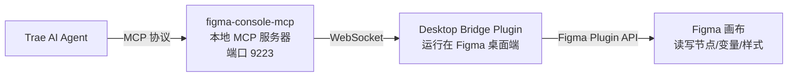
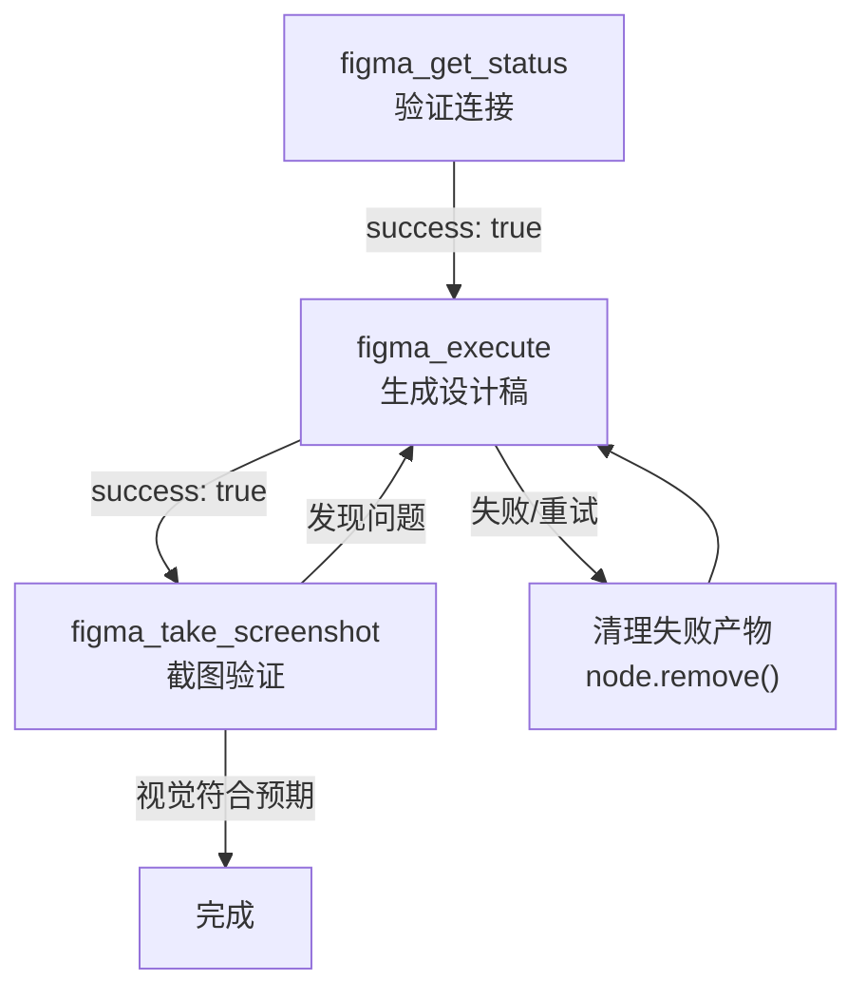

# AI Agent 操作 Figma 设计稿指南

> 通过 Trae AI Agent + figma-console-mcp，AI 可以直接在 Figma 画布上生成、修改设计稿。
> 本文档记录方案选型、环境配置、连接验证、生成流程与注意事项，作为前端设计交付的补充能力。

---

## 一、方案概述

### 1.1 能力边界

AI Agent 可以：
- 创建 Frame、Section、Text、Rectangle 等节点
- 设置填充、描边、圆角、字号等样式
- 管理设计变量（Variables）和模式（Modes）
- 实例化组件、克隆节点
- 截图验证生成结果

AI Agent 不能：
- 操作 Figma 以外的文件系统
- 执行需要 GUI 交互的操作（如点击菜单）
- 访问未通过 Figma Plugin API 暴露的能力

### 1.2 方案选型

| 方案 | 来源 | 工具数 | 写画布 | 选型 |
|------|------|--------|--------|------|
| figma-console-mcp | 开源（GitHub） | 106 | ✅ | ✅ 采用 |
| Figma AI Bridge MCP | Trae 插件市场 | 2 | ❌ 只读 | ❌ |

选型理由：
- figma-console-mcp 提供 106 个工具，覆盖节点操作、变量管理、组件实例化等全链路
- 核心工具 `figma_execute` 可执行任意 Figma Plugin API 代码，理论上能做任何插件能做的事
- Trae 插件市场的 Figma AI Bridge MCP 只有 2 个只读工具（`get_figma_data` / `download_figma_images`），无法生成设计稿

### 1.3 架构链路



四层链路缺一不可：
- **Trae AI Agent**：决策与代码生成
- **figma-console-mcp**：MCP 服务器，将 AI 调用转译为 Figma Plugin API 指令
- **Desktop Bridge Plugin**：Figma 桌面端插件，通过 WebSocket 桥接 MCP 与画布
- **Figma 画布**：实际执行节点操作

---

## 二、环境准备

### 2.1 前置条件

| 项目 | 要求 |
|------|------|
| Figma 账号 | 免费版即可（限制：3 个文件，每个文件页面数无限） |
| Figma 桌面端 | 必须用桌面端，浏览器版不支持插件 WebSocket 桥接 |
| Node.js | ≥ 18（npx 调用 MCP 服务器用） |
| Trae IDE | 已配置 MCP 服务器 |

### 2.2 生成 Personal Access Token

1. 登录 Figma → 头像 → Settings → Security → Personal access tokens
2. 生成 token（以 `figd_` 开头），记录下来
3. Token scopes 至少需要：
   - File content: Read only
   - Variables: Read only
   - Comments: Read and write

> Token 有有效期（默认 90 天），过期需重新生成并更新 Trae 配置。

### 2.3 导入 Desktop Bridge 插件

figma-console-mcp 首次启动时会自动将插件文件复制到 `C:\Users\{用户名}\.figma-console-mcp\plugin\`。

在 Figma 桌面端导入：
1. 打开任意 Figma 文件
2. 菜单：`Plugins → Development → Import plugin from manifest`
3. 选择 `C:\Users\{用户名}\.figma-console-mcp\plugin\manifest.json`
4. 导入后通过 `Plugins → Development → Figma Desktop Bridge` 运行
5. 运行后画布底部出现状态条，显示 `READY` / `CONNECTED` 即正常

> 多实例支持：插件支持端口 9223-9232，多个 Figma 文件可同时连接。

### 2.4 Trae MCP 配置

在 Trae 的 MCP 配置中添加（UI 配置或 `.vscode/mcp.json`）：

```json
{
  "mcpServers": {
    "figma-console": {
      "command": "npx",
      "args": ["-y", "figma-console-mcp@latest"],
      "env": {
        "FIGMA_ACCESS_TOKEN": "figd_YOUR_TOKEN_HERE",
        "ENABLE_MCP_APPS": "true"
      }
    }
  }
}
```

⚠️ **Trae 工具上限**：Trae 限制每个 MCP 服务器最多 40 个工具/会话。figma-console-mcp 有 106 个工具，需在 Trae UI 中勾选需要的工具。必勾工具清单见 [第四章 核心工具速查](#四核心工具速查)。

---

## 三、连接验证与生成流程

### 3.1 连接验证

每次开始前，先验证 MCP 与 Figma 插件的连接。调用 `figma_get_status`（参数 `probe: true`）：

```json
{ "probe": true }
```

成功响应关键字段：
- `transport.active: "websocket"` — 传输层就绪
- `transport.websocket.available: true` — WebSocket 已连接
- `setup.valid: true` — 整体配置有效
- `probeResult.success: true` — 插件实际响应（延迟通常 < 10ms）
- `connectedFile.fileName` — 当前连接的 Figma 文件名

失败常见原因：
- 插件未运行 → 在 Figma 桌面端运行 Desktop Bridge 插件
- 端口冲突 → 确认 9223 端口未被占用，或检查 fallback 端口 9224-9232
- Token 失效 → 重新生成 Personal Access Token

### 3.2 生成设计稿

通过 `figma_execute` 执行 Figma Plugin API 代码生成设计稿。

**代码模板**：

```javascript
// 1. 定位目标页面（不新建已存在的页面）
const root = figma.root;
let page = root.children.find(p => p.name === "MCP 测试");
if (!page) { page = root.children[0]; }

// 2. 创建 Section 作为容器（符合 figma_execute 的 PLACEMENT 规范）
const section = figma.createSection();
section.name = "功能域名称";
page.appendChild(section);

// 3. 创建 Frame 作为画板
const frame = figma.createFrame();
frame.name = "页面名称";
frame.resize(1440, 900);
frame.fills = [{ type: 'SOLID', color: { r: 0.98, g: 0.98, b: 0.99 } }];
section.appendChild(frame);

// 4. 加载字体（Text 节点必须先 loadFontAsync）
const fontBold = { family: "Inter", style: "Bold" };
await figma.loadFontAsync(fontBold);

// 5. 创建文本
const title = figma.createText();
title.fontName = fontBold;
title.fontSize = 32;
title.characters = "标题文本";
title.x = 64;
title.y = 48;
frame.appendChild(title);

// 6. 视口聚焦到生成的内容
figma.viewport.scrollAndZoomIntoView([frame]);

return { sectionId: section.id, frameId: frame.id };
```

### 3.3 截图验证

生成后调用 `figma_take_screenshot` 验证视觉效果：

```json
{ "nodeId": "4:3", "scale": 1.5 }
```

返回 PNG/JPG 图片，用于检查对齐、间距、比例。发现问题可迭代修改（最多 3 次）。

### 3.4 完整闭环



---

## 四、核心工具速查

| 工具 | 用途 | 必勾 |
|------|------|------|
| `figma_get_status` | 验证连接（`probe:true` 主动探测） | ✅ |
| `figma_execute` | 执行任意 Figma Plugin API 代码（最强大） | ✅ |
| `figma_take_screenshot` | 截图验证生成结果 | ✅ |
| `figma_create_variable` | 创建设计变量 | 按需 |
| `figma_batch_create_variables` | 批量创建变量 | 按需 |
| `figma_set_fills` | 设置节点填充 | 按需 |
| `figma_set_strokes` | 设置节点描边 | 按需 |
| `figma_resize_node` | 调整节点尺寸 | 按需 |
| `figma_clone_node` | 克隆节点 | 按需 |
| `figma_instantiate_component` | 实例化组件 | 按需 |
| `figma_get_selection` | 获取当前选中节点 | 按需 |
| `figma_navigate` | 导航到指定节点 | 按需 |

> `figma_execute` 可执行任意代码，理论上能替代大部分工具。但专用工具更语义化、更安全，优先使用专用工具；复杂操作再用 `figma_execute`。

---

## 五、figma_execute 使用规范

### 5.1 PLACEMENT 原则（放置）

- **永远在 Section 或 Frame 内创建内容**，不要直接放在空白画布上
- **定位时避开已有内容**：放在现有内容下方或远离的位置，不要重叠
- **创建前先截图**：查看目标页面现有内容，找到空闲区域

### 5.2 HOUSEKEEPING 原则（清理）

- **失败重试前必须清理**：用 `node.remove()` 删除失败的半成品（空 Frame、孤立图层）
- **不要新建已存在的页面**：先 `find` 同名页面，存在则复用
- **移除辅助图层**：代码创建的临时 Frame、占位节点等，最终结果不需要的都要删除

### 5.3 字体加载

创建 Text 节点前**必须**先 `await figma.loadFontAsync(font)`，否则会因字体未加载而失败。常用字体：
- `{ family: "Inter", style: "Bold" }`
- `{ family: "Inter", style: "Regular" }`

### 5.4 颜色格式

Figma Plugin API 的颜色是 0-1 浮点数，不是 0-255：
- 白色：`{ r: 1, g: 1, b: 1 }`
- 浅灰背景：`{ r: 0.98, g: 0.98, b: 0.99 }`
- 深色文字：`{ r: 0.1, g: 0.1, b: 0.15 }`

---

## 六、注意事项

### 6.1 Figma 免费版限制

- 最多 3 个**文件**（不是页面），每个文件页面数无限
- 建议：本项目只用 1 个文件，所有设计稿放不同页面

### 6.2 Trae 工具上限

- Trae 限制每个 MCP 服务器 40 个工具/会话
- figma-console-mcp 有 106 个工具，必须在 Trae UI 中勾选
- 核心工具（见第四章）必勾，其余按需

### 6.3 Token 安全

- Personal Access Token 等同于账号权限，不要提交到 Git
- Trae 配置中的 token 存在本地，不进入仓库

---

## 七、与项目文档的关系

| 文档 | 关系 |
|------|------|
| [design-system.md](design-system.md) | 设计规范（命名、交付物），第七章链接到本文档 |
| [doc-convention.md](../doc-convention.md) | 1.4.1 节前端设计章节规范，已更新 AI 生成 Figma 的规则 |
| [ai-assisted-development.md](../standards/ai-assisted-development.md) | AI 辅助开发体系，本文档是设计侧的补充 |
| 功能域文档的"前端设计"章节 | 页面布局处贴 Figma 链接，可由 AI 生成后补回 |
