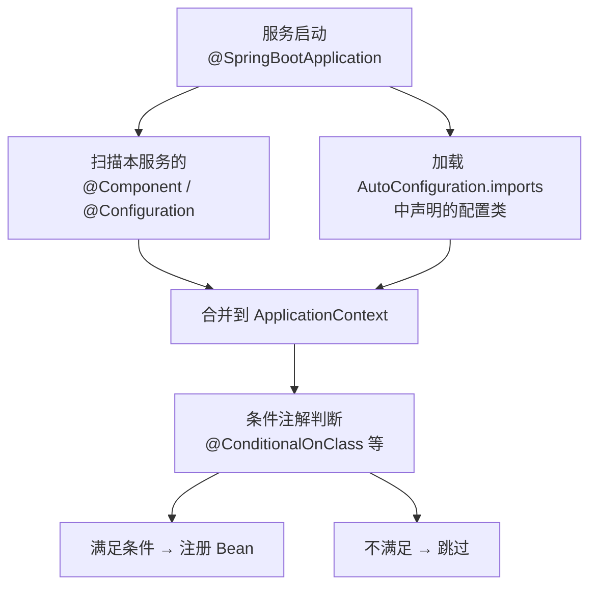
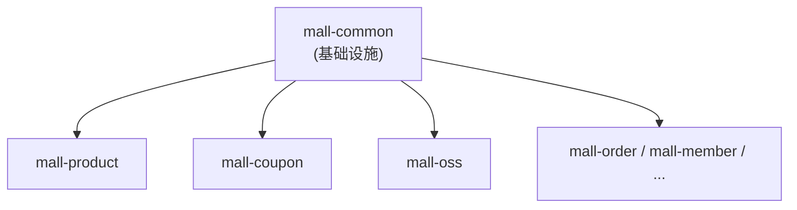

# 公共模块总览

## 为什么需要公共模块

微服务架构下，每个服务都是独立部署的进程，但它们之间有大量**重复的基础设施需求**：

- 统一的 API 响应格式（前端只需适配一套结构）
- 统一的异常处理（Service 抛异常 → Controller 不用 try-catch → 前端拿到友好提示）
- 统一的数据库实体基类（id / createTime / updateTime / 逻辑删除 / 乐观锁）
- 统一的配置（MyBatis-Plus 拦截器、Jackson 序列化、Swagger 文档）

如果没有公共模块，每个服务各自实现一遍，会导致：

1. **重复劳动**：12 个服务写 12 遍 GlobalExceptionHandler
2. **不一致**：A 服务用 `{code, msg, data}`，B 服务用 `{status, message, result}`，前端崩溃
3. **维护噩梦**：发现一个 bug 要改 12 个地方，漏改一个就是线上事故

公共模块的本质就是**DRY 原则在微服务架构下的落地**。

### 业界方案对比

| 方案 | 做法 | 优点 | 缺点 |
|------|------|------|------|
| **复制粘贴** | 每个服务自己写 | 简单直接 | 不一致、难维护 |
| **公共依赖 jar** | 本项目的做法，抽一个 mall-common | 一处修改全局生效 | 版本耦合，改 common 要全量发布 |
| **代码生成** | 用脚手架/模板生成服务骨架 | 可定制性强 | 生成的代码后续难同步更新 |
| **Sidecar** | 每个服务旁挂一个代理进程处理公共逻辑 | 语言无关 | 架构复杂，学习成本高 |

本项目是 Java 单体技术栈，公共依赖 jar 是最主流、最成熟的做法。Spring Cloud 自身也是这种方式（`spring-cloud-starter-*`）。

## 自动装配机制

### 问题：引入 jar 不等于生效

mall-common 里定义了 `MybatisPlusConfig`、`JacksonConfig` 等配置类。但业务服务只是 Maven 依赖引入了 mall-common 的 jar，Spring Boot 怎么知道要加载这些配置类？

这就需要**自动装配**（Auto-configuration）。

### Spring Boot 3 的自动装配原理



关键文件：`mall-common/src/main/resources/META-INF/spring/org.springframework.boot.autoconfigure.AutoConfiguration.imports`

```
com.mymall.common.config.MybatisPlusConfig
com.mymall.common.config.SpringDocConfig
com.mymall.common.config.JacksonConfig
com.mymall.common.oss.OssAutoConfiguration
```

> **Spring Boot 2 vs 3**：Spring Boot 2 用 `META-INF/spring.factories`，3.x 改用 `AutoConfiguration.imports`。新方式更清晰——一个类名一行，不再需要写 `EnableAutoConfiguration=` 前缀。

### 条件装配：不是引入了就一定生效

看 `OssAutoConfiguration` 上的注解：

```java
@Configuration
@ConditionalOnClass(MinioClient.class)       // classpath 有 MinIO 才生效
@ConditionalOnProperty(prefix = "oss.minio", name = "endpoint")  // 配了 endpoint 才生效
@EnableConfigurationProperties(OssProperties.class)
public class OssAutoConfiguration { ... }
```

- `@ConditionalOnClass`：mall-common 的 pom.xml 中 MinIO 是 `<optional>true</optional>`，业务服务不主动引入 MinIO 依赖时，classpath 没有 `MinioClient`，这个配置类直接跳过
- `@ConditionalOnProperty`：即使有 MinIO 依赖，也要在 yml 中配了 `oss.minio.endpoint` 才生效

这保证了**按需加载**——不需要 OSS 的服务不会因为引入 mall-common 而初始化 MinIO 相关 Bean。

### @ComponentScan 的补充作用

自动装配只加载 `AutoConfiguration.imports` 中声明的 4 个配置类。但 `MyMetaObjectHandler`（标注了 `@Component`）不在其中。它通过 `MybatisPlusConfig` 上的 `@ComponentScan("com.mymall.common")` 被扫描到：

```java
@Configuration
@ComponentScan("com.mymall.common")  // 扫描 common 包下所有 @Component
public class MybatisPlusConfig { ... }
```

这条路径的影响可控——只扫描 `com.mymall.common` 包内，不会意外扫描到业务服务的包。

## 依赖关系



几乎所有的业务服务都依赖 mall-common，唯一的例外是 `mall-search`（使用 OpenSearch，不需要 MyBatis-Plus/MySQL，独立配置）。

## 设计原则总结

1. **公共模块只放基础设施**，不放业务逻辑
2. **条件装配**：重依赖（如 MinIO）用 `@ConditionalOnClass` 按需加载
3. **全局兜底 + 注解覆盖**：GlobalConfig 声明默认策略，实体上的 `@TableId` / `@TableLogic` 注解优先级更高
4. **版本同步**：改 common 要考虑对所有服务的影响，所以 common 的变更要谨慎
