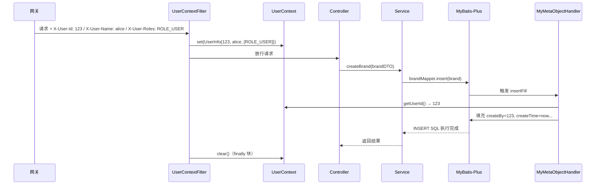

# 数据审计与用户上下文

> 涉及组件：`BaseEntity` → `MyMetaObjectHandler` → `UserContext` → `UserContextFilter`
>
> 这四个组件串成一条链：`BaseEntity` 定义审计字段 → `MyMetaObjectHandler` 自动填充 → 填充时从 `UserContext` 取用户 ID → `UserContextFilter` 从请求头解析用户 ID 写入 `UserContext`。

## 为什么需要数据审计

### 审计字段的作用

每条业务数据都有这些字段：

| 字段 | 用途 |
|------|------|
| `create_time` | 数据创建时间，排查问题、数据分析 |
| `update_time` | 最后修改时间，增量同步、并发判断 |
| `create_by` | 创建人，追责、权限 |
| `update_by` | 修改人，追责 |
| `is_deleted` | 逻辑删除，数据可恢复 |
| `version` | 乐观锁，防并发覆盖 |

如果每个 Entity 都手写这 7 个字段，每个 Service 都手动 `setCreateTime(now)`、`setUpdateBy(userId)`，代码重复度极高，而且容易忘。

### 业界方案对比

| 方案 | 代表 | 特点 |
|------|------|------|
| ORM 拦截器自动填充 | MyBatis-Plus MetaObjectHandler、JPA @PrePersist | 声明式，零侵入 |
| AOP 切面 | 自定义注解 + Aspect | 灵活但复杂 |
| 数据库默认值 + 触发器 | MySQL DEFAULT + TRIGGER | 不依赖代码，但跨数据库不兼容 |
| 手动 set | 最原始的方式 | 重复、易遗漏 |

本项目用 MyBatis-Plus 的 `MetaObjectHandler`，声明式且与 ORM 深度集成。

## BaseEntity：审计字段基类

### 字段与注解映射

```java
@Data
public class BaseEntity implements Serializable {

    @TableId(type = IdType.ASSIGN_ID)
    private Long id;                         // 雪花算法主键

    @TableField(fill = FieldFill.INSERT)
    private LocalDateTime createTime;        // 插入时填充

    @TableField(fill = FieldFill.INSERT_UPDATE)
    private LocalDateTime updateTime;        // 插入和更新时都填充

    @TableField(fill = FieldFill.INSERT)
    private Long createBy;                   // 插入时填充（从 UserContext 取）

    @TableField(fill = FieldFill.INSERT_UPDATE)
    private Long updateBy;                   // 插入和更新时都填充

    @TableLogic
    @TableField(fill = FieldFill.INSERT)
    private Integer isDeleted;               // 逻辑删除标记

    @Version
    @TableField(fill = FieldFill.INSERT)
    private Integer version;                 // 乐观锁版本号
}
```

### `FieldFill` 的含义

| 值 | 何时填充 | 适用字段 |
|------|---------|---------|
| `INSERT` | 仅 INSERT 时填充 | createTime、createBy、isDeleted、version |
| `INSERT_UPDATE` | INSERT 和 UPDATE 都填充 | updateTime、updateBy |
| `DEFAULT` | 不自动填充 | 业务字段 |

关键：`FieldFill` 只是声明"何时填充"，具体"填什么值"由 `MyMetaObjectHandler` 实现。

### 主键策略：为什么用 ASSIGN_ID

```java
@TableId(type = IdType.ASSIGN_ID)
```

| 策略 | 生成方式 | 优缺点 |
|------|---------|--------|
| `AUTO` | 数据库自增 | 简单，但分库分表后主键冲突 |
| `ASSIGN_ID` | 雪花算法（分布式唯一 ID） | 分布式友好，19 位 Long，趋势递增 |
| `ASSIGN_UUID` | UUID | 无序，B+ 树插入性能差 |
| `INPUT` | 手动输入 | 需要外部 ID 生成器 |

`ASSIGN_ID` 的雪花算法生成的 ID 是 19 位 Long（如 `1895273648392216576`），这会引出前端精度问题，见 [05-global-config.md](./05-global-config.md) 中 JacksonConfig 的讲解。

### 逻辑删除：为什么不物理删除

```java
@TableLogic
private Integer isDeleted;  // 0=正常, 1=已删除
```

`@TableLogic` 让 MyBatis-Plus 自动把 `DELETE` 转成 `UPDATE SET is_deleted=1`，查询时自动加 `WHERE is_deleted=0`。

逻辑删除的好处：
- 数据可恢复（误删、审计需要）
- 关联数据不会因外键级联物理删除而丢失

代价：数据量会持续增长，需要定期归档清理。

### 乐观锁：防并发覆盖

```java
@Version
private Integer version;
```

```sql
-- 乐观锁的 SQL 原理
UPDATE pms_brand SET name='小米', version=version+1
WHERE id=1 AND version=3;
-- 如果 version 不匹配（别人改过），affected rows = 0
```

乐观锁 vs 悲观锁（`SELECT ... FOR UPDATE`）：
- 乐观锁：适合读多写少，无锁等待，吞吐量高
- 悲观锁：适合写竞争激烈，直接锁行避免重试

电商场景大部分是读多写少（商品浏览 >> 商品修改），乐观锁更合适。

## MyMetaObjectHandler：字段自动填充

### 实现原理

```java
@Component
public class MyMetaObjectHandler implements MetaObjectHandler {

    @Override
    public void insertFill(MetaObject metaObject) {
        LocalDateTime now = LocalDateTime.now();
        Long userId = UserContext.getUserId();  // ← 关键：从 ThreadLocal 取用户 ID

        this.strictInsertFill(metaObject, "createTime", LocalDateTime.class, now);
        this.strictInsertFill(metaObject, "updateTime", LocalDateTime.class, now);
        this.strictInsertFill(metaObject, "createBy", Long.class, userId);
        this.strictInsertFill(metaObject, "updateBy", Long.class, userId);
        this.strictInsertFill(metaObject, "isDeleted", Integer.class, 0);
        this.strictInsertFill(metaObject, "version", Integer.class, 1);
    }

    @Override
    public void updateFill(MetaObject metaObject) {
        this.strictUpdateFill(metaObject, "updateTime", LocalDateTime.class, LocalDateTime.now());
        this.strictUpdateFill(metaObject, "updateBy", Long.class, UserContext.getUserId());
    }
}
```

### strictInsertFill vs fillStrategy

`strictInsertFill`（严格模式）：**字段已有值时不覆盖**。

```java
// 如果手动设置了 createTime，不会被自动填充覆盖
brand.setCreateTime(customTime);
brandMapper.insert(brand);  // strictInsertFill 不会覆盖 customTime
```

MyBatis-Plus 3.5+ 推荐用 `strictXxxFill`，旧版的 `fillStrategy` 是非严格模式（总是覆盖）。

### 与 UserContext 的耦合点

`MyMetaObjectHandler` 依赖 `UserContext.getUserId()`，这是整条链路的核心连接点：

```
请求线程 → UserContextFilter 设置 userId → UserContext (ThreadLocal)
    ↓
MyBatis-Plus 执行 INSERT/UPDATE → 触发 MyMetaObjectHandler
    ↓
从 UserContext 取 userId → 填充到 createBy/updateBy
```

如果 `UserContext.getUserId()` 返回 null（未登录场景），`createBy` 会填 null，不影响业务流程。

## UserContext：请求级用户上下文

### ThreadLocal 的作用

```java
public final class UserContext {
    private static final ThreadLocal<UserInfo> HOLDER = new ThreadLocal<>();

    public static void set(UserInfo user) { HOLDER.set(user); }
    public static UserInfo get() { return HOLDER.get(); }
    public static Long getUserId() {                       // 兼容方法，供 MyMetaObjectHandler 使用
        UserInfo u = HOLDER.get();
        return u == null ? null : u.userId();
    }
    public static void clear() { HOLDER.remove(); }
}
```

> `UserContext` 已升级为 `ThreadLocal<UserInfo>`（v1.3，2026-07-01），存储完整用户身份（userId / username / roles）。`getUserId()` 静态方法保留，避免影响 `MyMetaObjectHandler` 等已存在的调用点。完整设计原理见 [07-user-context.md](./07-user-context.md)。

ThreadLocal 的核心特性：**每个线程有自己独立的变量副本**，线程之间互不干扰。

为什么需要它？因为 Servlet 容器用线程池处理请求，Service 层需要知道"当前操作者是谁"，但不想在每个方法参数里都加 `userId`：

```java
// 没有 UserContext：每个方法都要透传 userId
service.createBrand(userId, brandDTO);
service.updateBrand(userId, brandId, brandDTO);

// 有 UserContext：直接取
service.createBrand(brandDTO);  // 内部从 UserContext 取 userId
```

### ThreadLocal 的内存泄漏风险

ThreadLocal 的底层结构：

```
Thread → ThreadLocalMap → Entry(WeakReference<ThreadLocal>, Value)
```

`WeakReference` 确保 ThreadLocal 对象本身可以被 GC，但 **Value 是强引用**。如果线程不结束（线程池复用线程），Value 不会被回收，导致内存泄漏。

所以 **`UserContext.clear()` 必须在请求结束时调用**，这由 `UserContextFilter` 的 `finally` 块保证：

```java
try {
    filterChain.doFilter(request, response);
} finally {
    UserContext.clear();  // 必须执行
}
```

### ThreadLocal 在异步场景的局限

```java
// @Async 异步方法中，UserContext.getUserId() 返回 null
@Async
public void asyncTask() {
    Long userId = UserContext.getUserId();  // null！
    // 因为 @Async 切换到另一个线程，ThreadLocal 不会自动传递
}
```

解决方案：
1. **主线程取出后显式传参**（简单直接，推荐）
2. **TransmittableThreadLocal**（阿里开源，支持线程池传递，但增加依赖）
3. **InheritableThreadLocal**（只在 `new Thread()` 时继承，线程池场景无效）

本项目的注释里明确说了当前业务都在请求线程内完成，够用。未来如果异步场景增多，可以升级为 `TransmittableThreadLocal`。

## UserContextFilter：请求头解析

> 注：`UserContextFilter` 位于 `mall-common/web` 包，所有业务模块通过自动装配共享。`UserContext` 升级为 `ThreadLocal<UserInfo>` 后，本过滤器解析三个头（`X-User-Id` / `X-User-Name` / `X-User-Roles`）组装为 `UserInfo` 写入上下文。详见 [07-user-context.md](./07-user-context.md)。

### 工作流程

```java
@Component
@Order(Ordered.HIGHEST_PRECEDENCE + 10)
public class UserContextFilter extends OncePerRequestFilter {

    public static final String USER_ID_HEADER = "X-User-Id";
    public static final String USER_NAME_HEADER = "X-User-Name";
    public static final String USER_ROLES_HEADER = "X-User-Roles";

    @Override
    protected void doFilterInternal(HttpServletRequest request, ...) {
        UserInfo userInfo = parseUserInfo(request);
        if (userInfo != null) {
            UserContext.set(userInfo);  // 升级为 UserInfo
        }
        try {
            filterChain.doFilter(request, response);
        } finally {
            UserContext.clear();
        }
    }
}
        }
        try {
            filterChain.doFilter(request, response);
        } finally {
            UserContext.clear();
        }
    }
}
```

### 为什么用 `X-User-Id` 请求头

```
用户请求 → 网关（JWT 校验）→ 提取 userId → 塞入 X-User-Id 请求头
    → 转发到业务微服务 → UserContextFilter 解析 X-User-Id → UserContext
```

网关统一鉴权后，业务微服务不需要再校验 JWT，只需信任网关塞入的 `X-User-Id`。

安全性保证：
- 微服务不对外暴露，只能通过网关访问
- `X-User-Id` 由网关设置，业务服务信任该头
- 如果微服务直接暴露，攻击者可以伪造 `X-User-Id`（所以生产环境微服务必须在内网）

### `@Order` 优先级

```java
@Order(Ordered.HIGHEST_PRECEDENCE + 10)
```

`HIGHEST_PRECEDENCE` 是 Integer.MIN_VALUE，`+10` 让它比最高优先级稍低，确保在 Spring Security Filter Chain 之前执行。这样即使用户未通过安全校验被拦截，ThreadLocal 也已被正确设置或清理。

### `OncePerRequestFilter` 的意义

普通 Filter 在请求转发（forward/include）时可能被调用多次。`OncePerRequestFilter` 保证每个请求只执行一次，避免重复设置/清理 ThreadLocal。

## 全链路串联



## 设计取舍总结

| 决策 | 选择 | 理由 |
|------|------|------|
| 审计字段管理 | BaseEntity 继承 + MetaObjectHandler | 零侵入，业务代码不感知 |
| 填充模式 | strictInsertFill 严格模式 | 手动设置的值不被覆盖 |
| 用户上下文 | ThreadLocal | 不污染方法签名，请求线程内有效 |
| 线程池安全 | finally 块 clear() | 防止线程复用导致身份串号 |
| 用户身份传递 | 网关 X-User-Id 请求头 | 业务服务不重复校验 JWT |
