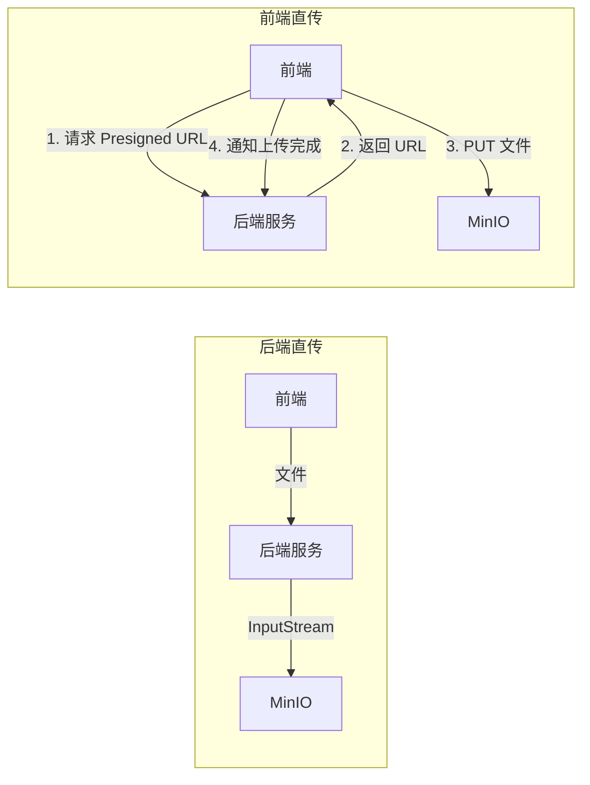

# 对象存储 SDK

> 涉及组件：`OssTemplate` → `OssProperties` → `OssAutoConfiguration`
>
> 这三个组件构成一个迷你的 Spring Boot Starter，演示了自动配置的标准设计模式。

## 为什么需要封装 OSS

### 直接用 MinIO Client 的问题

```java
// 每个 Service 直接用 MinioClient
@Service
public class FileService {
    @Autowired
    private MinioClient minioClient;

    public void upload(String bucket, String objectName, InputStream stream) {
        try {
            minioClient.putObject(PutObjectArgs.builder()
                    .bucket(bucket)
                    .object(objectName)
                    .stream(stream, -1, -1)
                    .contentType("application/octet-stream")
                    .build());
        } catch (Exception e) {
            // 每个 Service 都要自己处理异常
            throw new RuntimeException("上传失败", e);
        }
    }
}
```

问题：
1. 每个 Service 重复写 try-catch + 参数构建
2. 存储引擎从 MinIO 换到 AWS S3 时，所有 Service 都要改
3. 配置散落在各处，没有统一管理

### Template 模式

业界经典做法是 **Template 模式**（不是 GoF 的模板方法模式，而是"操作模板"的含义）：

| 框架 | Template 类 | 封装的底层 |
|------|------------|-----------|
| Spring | JdbcTemplate | JDBC |
| Spring Data Redis | RedisTemplate | Redis 客户端 |
| Spring Data MongoDB | MongoTemplate | MongoDB Driver |
| **本项目** | OssTemplate | MinioClient |

Template 的核心价值：封装底层 API 的样板代码（try-catch、参数构建、异常转换），暴露简洁的业务方法。

## OssTemplate：操作模板

### 方法清单

| 方法 | 用途 | 返回值 |
|------|------|--------|
| `upload()` | 后端直传文件 | objectName |
| `getPresignedPutUrl()` | 生成前端直传 URL | Presigned URL |
| `getPresignedGetUrl()` | 生成私有文件下载 URL | Presigned URL |
| `delete()` | 删除单个文件（幂等） | void |
| `batchDelete()` | 批量删除 | void |
| `statObject()` | 检查文件是否存在 | StatObjectResponse / null |
| `buildPublicUrl()` | 拼接公开访问 URL | 完整 URL |

### 后端直传 vs 前端直传



| 方式 | 优点 | 缺点 | 适用场景 |
|------|------|------|---------|
| 后端直传 | 简单，后端全控制 | 文件流经后端，占带宽和内存 | 小文件、需要预处理 |
| 前端直传 | 不经后端，性能好 | 流程复杂，需要签名和回调 | 大文件、高并发上传 |

本项目两种都支持：`upload()` 用于后端直传，`getPresignedPutUrl()` 用于前端直传。详细设计见 [object-storage-design.md](../../mall-product/object-storage-design.md)。

### 幂等删除的设计

```java
public void delete(String bucket, String objectName) {
    try {
        minioClient.removeObject(...);
    } catch (ErrorResponseException e) {
        if ("NoSuchKey".equals(e.errorResponse().code())) {
            // 对象不存在视为删除成功
            return;
        }
        throw new RuntimeException("文件删除失败", e);
    }
}
```

幂等删除的思路：删一个不存在的文件不算错误，返回成功。这样在清理未完成上传的 PENDING 记录时，不需要先 check 再 delete，直接 delete 即可。

### buildPublicUrl 的 CDN 设计

```java
public String buildPublicUrl(String bucket, String objectName) {
    String base = (properties.getPublicBaseUrl() != null && !properties.getPublicBaseUrl().isBlank())
            ? properties.getPublicBaseUrl()    // CDN 域名：https://img.mall.com
            : properties.getEndpoint();        // 回退到 MinIO 内网地址
    return base + "/" + bucket + "/" + objectName;
}
```

为什么需要 `publicBaseUrl`？
- MinIO 的 `endpoint` 是内网地址（`http://127.0.0.1:9000`），前端访问不了
- 生产环境用 CDN 域名（`https://img.mall.com`），留空时回退到 endpoint 方便本地开发

## OssProperties：配置属性绑定

```java
@Data
@ConfigurationProperties(prefix = "oss.minio")
public class OssProperties {
    private String endpoint = "http://127.0.0.1:9000";
    private String publicBaseUrl;           // CDN 域名，留空回退到 endpoint
    private String region;                  // MinIO 本地不填，S3 兼容模式必填
    private String accessKey = "minioadmin";
    private String secretKey = "minioadmin123";
}
```

### `@ConfigurationProperties` vs `@Value`

| 方式 | 特点 |
|------|------|
| `@Value("${oss.minio.endpoint}")` | 简单，但每个字段一个注解，无校验，不支持松散绑定 |
| `@ConfigurationProperties(prefix = "oss.minio")` | 统一绑定到一个类，支持松散绑定、JSR-303 校验、IDE 配置提示 |

`@ConfigurationProperties` 的松散绑定：`oss.minio.public-base-url` → `publicBaseUrl`，支持 kebab-case、camelCase、下划线等多种命名风格。

### `spring-boot-configuration-processor`

pom.xml 里有这个依赖：
```xml
<dependency>
    <groupId>org.springframework.boot</groupId>
    <artifactId>spring-boot-configuration-processor</artifactId>
    <optional>true</optional>
</dependency>
```

它的作用：编译时生成 `META-INF/spring-configuration-metadata.json`，让 IDE 在 yml 里输入 `oss.minio.` 时自动提示字段名和默认值。`optional=true` 表示不传递给依赖方。

## OssAutoConfiguration：自动配置

```java
@Configuration
@ConditionalOnClass(MinioClient.class)
@ConditionalOnProperty(prefix = "oss.minio", name = "endpoint")
@EnableConfigurationProperties(OssProperties.class)
public class OssAutoConfiguration {

    @Bean
    public MinioClient minioClient(OssProperties properties) { ... }

    @Bean
    public OssTemplate ossTemplate(MinioClient minioClient, OssProperties properties) { ... }
}
```

### 三个条件注解

| 注解 | 条件 | 为什么需要 |
|------|------|-----------|
| `@ConditionalOnClass(MinioClient.class)` | classpath 有 MinIO 类 | 不引入 minio 依赖的服务不会触发自动配置 |
| `@ConditionalOnProperty(prefix = "oss.minio", name = "endpoint")` | 配了 `oss.minio.endpoint` | 引入了依赖但不需要 OSS 的服务不触发 |
| `@EnableConfigurationProperties` | 启用属性绑定 | 让 `OssProperties` 被实例化为 Bean |

### MinIO 依赖为什么是 optional

```xml
<dependency>
    <groupId>io.minio</groupId>
    <artifactId>minio</artifactId>
    <optional>true</optional>
</dependency>
```

`optional=true`：mall-common 引入了 MinIO，但**不会传递**给依赖 mall-common 的业务模块。

效果：
- `mall-oss` 需要用 OSS → 自己的 pom 显式引入 minio 依赖 → `@ConditionalOnClass` 通过 → 自动配置生效
- `mall-product` 不需要 OSS → 不引入 minio → `@ConditionalOnClass` 不满足 → 自动配置不生效

这是 Spring Boot Starter 的标准设计模式：**让引入方决定是否启用功能**。

### region 的条件设置

```java
if (properties.getRegion() != null && !properties.getRegion().isBlank()) {
    builder.region(properties.getRegion());
}
```

MinIO 本地部署不需要 region，但迁移到 AWS S3 或阿里云 OSS（S3 兼容模式）时 region 必填，否则签名验证失败。这个条件设置让同一套代码兼容本地和生产。

## 自动配置注册

在 `META-INF/spring/org.springframework.boot.autoconfigure.AutoConfiguration.imports` 中：

```
com.mymall.common.config.MybatisPlusConfig
com.mymall.common.config.SpringDocConfig
com.mymall.common.config.JacksonConfig
com.mymall.common.oss.OssAutoConfiguration
```

Spring Boot 3.x 不再用 `spring.factories`，改用这个文件注册自动配置类。启动时 Spring Boot 扫描此文件，按条件注解决定是否加载。

## 设计取舍总结

| 决策 | 选择 | 理由 |
|------|------|------|
| 封装方式 | Template 模式 | 业界惯例（JdbcTemplate/RedisTemplate），封装样板代码 |
| 上传方式 | 后端直传 + 前端直传双支持 | 小文件走后端，大文件走前端直传 |
| 删除策略 | 幂等删除 | 简化调用方逻辑，不需要 check-then-delete |
| 配置绑定 | @ConfigurationProperties | 支持松散绑定、IDE 提示、JSR-303 校验 |
| MinIO 依赖 | optional=true | 不强加给不需要 OSS 的服务 |
| 自动配置条件 | @ConditionalOnClass + @ConditionalOnProperty | 双重保险，按需加载 |
| CDN 支持 | publicBaseUrl + endpoint 回退 | 生产用 CDN，开发用本地 |
