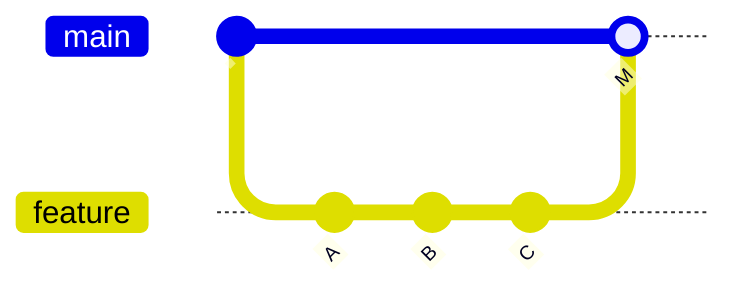
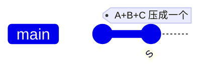
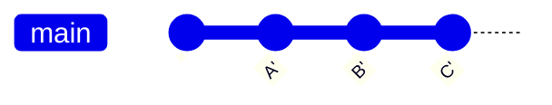

# 03 · Pull Request 与代码审查

> Pull Request 是 GitHub Flow 的核心环节。本章讲清：PR 的完整生命周期、PR 描述怎么写、Code Review 怎么做、三种合并策略的区别、Draft PR 和关联 Issue 的技巧。

## 3.1 PR 是什么

Pull Request（PR，拉取请求）：**我有一个分支上的改动，请求你把它们合并到目标分支**。

- 「Pull」是从目标分支视角说的——「请你把我的改动 pull 过去」
- Git 本身没有 PR，这是 GitHub 在 Git 合并操作之上封装的**协作界面**：附带了 diff 展示、讨论区、Review 审批、CI 状态、合并按钮
- 一次 PR = 一次代码审查 + 合并的单元，是团队协作的最小颗粒

> GitLab 里同样的东西叫 Merge Request（MR），概念完全一样。GitHub 叫 PR。

## 3.2 PR 的完整生命周期

```
[建分支改代码] → [push 到远程] → [发 PR] → [CI 自动跑]
                                          ↓
                                   [Reviewer 审查]
                                   ↙     ↓      ↘
                              要求改   批准    关闭拒绝
                                ↓       ↓
                          [改完再 push] [Merge 按钮]
                                ↑       ↓
                                └── [合并到目标分支] → [PR 关闭]
                                                     ↓
                                              [关联 Issue 自动关闭]
```

### 步骤 1：建分支 + 改代码 + push

```bash
# 从 main 拉新分支
$ git switch -c feature/cart-batch-check

# 改代码、commit（可多次）
$ git add .
$ git commit -m "feat(cart): 购物车支持批量勾选"

# push 到远程（-u 设置上游跟踪，下次 git push 不用带分支名）
$ git push -u origin feature/cart-batch-check
```

### 步骤 2：发起 PR

push 后，GitHub 仓库主页会出现一个黄色横条「`feature/cart-batch-check` had recent pushes · Compare & pull request」，点它就进入发 PR 页面。

或者：仓库 → Pull requests → New pull request → 选 base 分支和 compare 分支。

PR 关键字段：

| 字段 | 说明 |
|------|------|
| Base | 目标分支（要合并到哪），通常是 `main` |
| Compare | 源分支（你的改动分支） |
| Title | PR 标题，建议遵循 Conventional Commits 风格 |
| Description | PR 描述（下面详讲） |
| Reviewers | 指定审查者 |
| Assignees | 负责人（通常是 PR 作者自己） |
| Labels | 标签 |
| Projects / Milestone | 关联项目 / 里程碑 |

### 步骤 3：CI 自动跑

PR 一旦发起，配置了触发条件的 GitHub Actions workflow 会自动运行（如跑测试、构建、lint）。结果会显示在 PR 页面底部「Checks」区。Reviewer 通常等 CI 绿了才审查。

### 步骤 4：Review

Reviewer 在 PR 页面：
- **Files changed** 标签页看 diff
- 对某行代码鼠标悬停会出现 `+` 按钮，可写行内评论
- 顶部 Review 按钮：Comment（仅评论）/ Approve（批准）/ Request changes（要求修改）

### 步骤 5：合并

至少一个 Approve + CI 通过 → PR 页面底部出现绿色 **Merge pull request** 按钮 → 点合并 → 选合并策略 → 确认 → PR 自动关闭。

## 3.3 PR 描述怎么写

PR 描述是给 Reviewer 看的「这份改动是什么、为什么、怎么测的」。好的描述让 Review 半小时搞定，差的描述让 Reviewer 一头雾水来回问。

### 推荐模板

```markdown
## 改了什么
（一两句话说明本次改动内容）

## 为什么改
（背景、动机、关联 Issue。如 `fixes #42` `closes #88`）

## 怎么实现的
（关键实现思路、设计选择、不明显的逻辑要解释）

## 怎么测的
1. 启动 mall-cart 服务
2. POST /cart/checkBatch，body 用以下数据：
   ```json
   {...}
   ```
3. 预期：返回 200，购物车勾选状态更新
4. 实际：✅ 符合预期

## 影响范围 / 风险
- 影响购物车勾选接口
- 不影响下单流程
- 风险：批量上限 100，超过会报 400

## Checklist
- [x] 已加单元测试
- [x] 已跑本地测试通过
- [x] 已更新相关文档
- [x] commit 信息符合规范
```

### 关键技巧

- **关联 Issue**：描述里写 `fixes #42` / `closes #42` / `resolves #42`，PR 合并时 GitHub 会**自动关闭**对应 Issue。这是 GitHub 的 magic keyword，三个词等价。
- **贴截图**：UI 改动贴 before/after 截图，比文字描述直观
- **标注 breaking change**：有破坏性变更要在描述里醒目标注
- **小而聚焦**：一个 PR 只做一件事，500 行以内最佳。大 PR 拆成多个小 PR

## 3.4 Code Review 实践

### Reviewer 该看什么

| 维度 | 关注点 |
|------|--------|
| 正确性 | 逻辑对吗？边界条件处理了吗？空指针、并发、事务？ |
| 设计 | 分层对吗？职责清晰吗？有没有过度设计？ |
| 可读性 | 命名清晰吗？需要注释的地方有注释吗？ |
| 测试 | 有测试吗？测试覆盖关键路径吗？ |
| 安全 | 输入校验了吗？SQL 注入、XSS？密钥硬编码？ |
| 性能 | N+1 查询？循环里调远程接口？大对象未释放？ |
| 规范 | 符合项目编码规范？commit message 规范？ |

### Review 礼仪

- **对事不对人**：评论代码而不是评论人。「这里循环调 Feign 可能慢」✓ 「你怎么写成这样」✗
- **区分 must / nice-to-have**：blocking 问题用 `Request changes`，建议性意见前缀 `nit:`（小问题）或 `suggestion:`，作者可改可不改
- **解释 why**：不只说「这样写不好」，要说「这样写会导致 N+1 查询，建议改成批量」
- **及时响应**：作者被 review 后尽快改、回复；Reviewer 收到 PR 尽快看，别让 PR 阻塞几天
- **表扬好的写法**：看到巧妙的设计可以点赞，不一定要挑刺

### 作者该做的

- **PR 描述写清楚**（见 3.3）
- **自审一遍**：发 PR 前自己先 review 一遍 diff，常能发现低级错误（debug 日志没删、TODO 没删）
- **小 commit**：每个 commit 聚焦一件事，方便 reviewer 按提交逐步看
- **回应评论**：每条 review 评论都回复（解释 / 已改 / 不同意并说明理由），不要无视
- **改完别 squash**：在 PR 阶段保留每次修改的 commit，让 reviewer 能看到「这是根据 review 改的部分」。最终合并时再决定是否 squash（见 3.5）

## 3.5 三种合并策略

合并 PR 时有三个按钮（可在仓库设置里禁用某些）：

### Create a merge commit（默认）



把 feature 分支的所有 commit 原封不动合进 main，再加一个 merge commit `M` 标记这次合并。

- **历史完整**：能看到每次合并的边界、来自哪个分支
- **历史非线性**：图形分叉，commit 多时容易乱
- **适合**：想保留所有分支历史

### Squash and merge（推荐用于本项目）



把 feature 分支上的多个 commit 压成**一个**新 commit 写到 main，feature 分支原 commit 不进 main。

- **历史线性干净**：main 上一个 PR 一个 commit，看 main 历史一目了然
- **丢掉中间过程**：feature 上那些「修 typo」「跑通测试」的脏 commit 不污染 main
- **适合**：feature 分支 commit 多且杂、只想在 main 留一个干净 commit

> 本项目推荐用这个，因为 AI 辅助开发过程中 feature 分支常有大量小提交，squash 后 main 历史清爽。本项目 [git-workflow.md](../../standards/git-workflow.md) 也明确要求合并到 main 时 squash。

### Rebase and merge



把 feature 分支的 commit 逐个「挪」到 main 末尾，每个 commit 哈希被重写。

- **历史线性**：和 squash 一样没有 merge commit
- **保留每个 commit**：和 squash 不同，每个 commit 单独进 main
- **适合**：feature 分支上每个 commit 都有意义、想保留粒度

### 三者对比

| | Merge commit | Squash | Rebase |
|---|--------------|--------|--------|
| 历史形态 | 非线性 | 线性 | 线性 |
| 保留 commit 数 | 全部 +1 | 压成 1 | 全部 |
| merge commit | 有 | 无 | 无 |
| 推荐场景 | 大特性分支、想保留边界 | PR commit 多且杂 | PR commit 精心拆分 |

### 配置允许的合并方式

仓库 **Settings → General → Pull Requests → Merge button** 可勾选允许哪几种。本项目建议只开 Squash 和 Rebase，关掉 Merge commit（避免 main 历史出现分叉）。

## 3.6 Draft PR

发起 PR 时可选「Create draft pull request」（或在 PR 页面底部转 Draft）。Draft PR：

- 明确表示「这 PR 还没准备好，先看看方向对不对」
- **不能合并**（必须先 Mark as ready for review）
- 默认不指派 Reviewer（避免误以为要审了）
- CI 仍会跑（如果想早暴露问题）

适合：
- 大改动想早分享进度
- 想用 CI 跑测试看是否通过
- 想让团队看看方向对不对再继续做

## 3.7 关联 Issue 与自动关闭

GitHub 识别这些关键词，PR 合并时自动关闭对应 Issue：

- `fixes #42`
- `closes #42`
- `resolves #42`
- `fixes QiHaoo/my-mall#42`（跨仓库）
- `fixes https://github.com/QiHaoo/my-mall/issues/42`

放在 PR 描述任意位置都行。三个动词等价，用哪个看习惯。

反向也可手动：在 Issue 里提 PR 编号 `#123` 会自动建立链接（但不会自动关闭 Issue）。

## 3.8 处理冲突

PR 的 base 分支在前进了，你的 feature 分支落后了，合并时就会冲突。两种处理方式：

### Merge 进 base（推荐用这个）

```bash
# 当前在 feature 分支
$ git fetch origin
$ git merge origin/main
# 解决冲突 → git add → git commit
$ git push
```

会生成一个 merge commit，PR 自动更新为冲突已解决。

### Rebase 到 base

```bash
$ git fetch origin
$ git rebase origin/main
# 解决冲突 → git add → git rebase --continue
$ git push --force-with-lease  # rebase 重写了历史，需强推
```

历史更线性，但要 force push。`--force-with-lease` 比 `--force` 安全，会检查远程是否被别人推过。

> 如果团队规范是 squash merge，feature 分支最终会被压扁，rebase 还是 merge 解决冲突都行，选顺手的。本项目用 merge 解决冲突更简单。

## 3.9 本项目对照

本项目的 PR 实践（见 [git-workflow.md](../../standards/git-workflow.md)）：

- 分支命名：`feature/<模块>-<功能>`、`fix/<模块>-<问题>`
- 提交信息：Conventional Commits（`feat:` / `fix:` / `docs:` / `refactor:` / `chore:`）
- 合并方式：Squash and merge（main 上一个 PR 一个 commit）
- PR 描述：参考 3.3 模板
- Review：自审 + 至少一次自我审查（个人项目可单人，团队项目至少一个 Approve）
- 关联 Issue：用 `closes #xx` 自动关闭

## 小结

| 你应该记住的 |
|---|
| PR = 「请把我的分支合并过去」+ 协作界面（diff、讨论、Review、CI、合并按钮） |
| PR 描述要写清「改了什么 / 为什么 / 怎么实现 / 怎么测 / 风险」 |
| 关联 Issue 用 `closes #42`，PR 合并时自动关闭 Issue |
| 三种合并：Merge commit（保留全部）/ Squash（压成一个，推荐）/ Rebase（线性保留每个） |
| Draft PR 用于「方向先对一下，别急着合」 |
| 冲突解决：merge（生成 merge commit）或 rebase（线性但需 force push） |

下一章 [04-分支保护与规则](./04-branch-protection.md) 讲怎么用规则强制「main 不能直接 push、必须 PR + Review + CI 通过才能合并」。
