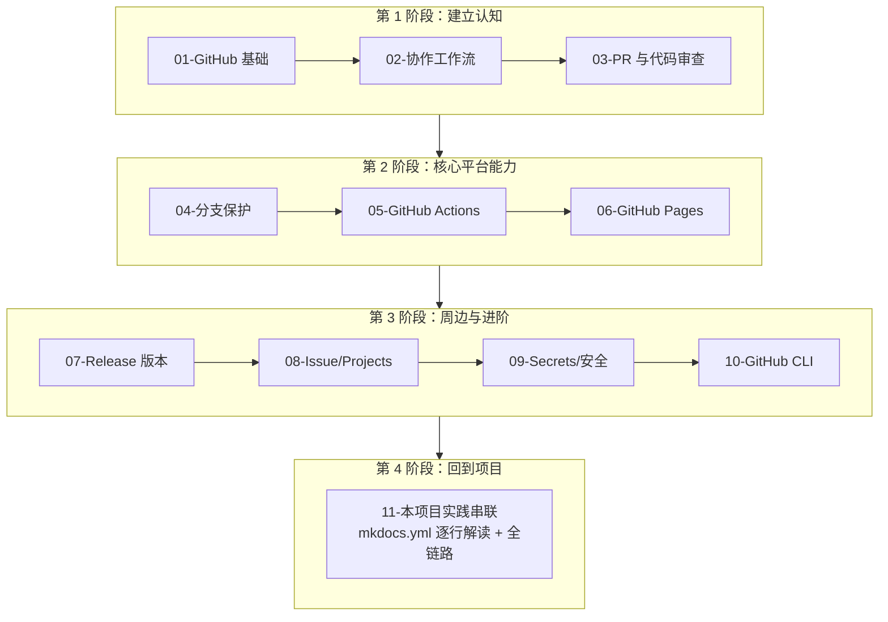

# GitHub 学习笔记

> 目标：从「没用过 GitHub」到「全面理解 GitHub 在现代开发工作流中的作用」，并能看懂、改得动本项目里 `.github/workflows/mkdocs.yml` 这类配置。

## 为什么单独学 GitHub

很多人对 GitHub 的认知停留在「Git 远程仓库托管」。但现在的 GitHub 已经是一整套**研发协作平台**：

- 代码托管（Git 仓库）
- 协作工作流（Pull Request、Code Review、分支保护）
- 持续集成 / 持续交付（GitHub Actions）
- 静态站点托管（GitHub Pages）
- 项目管理（Issues、Projects、Discussions）
- 软件发布（Releases、Tags）
- 安全扫描（Dependabot、CodeQL、Secret Scanning）

本项目就用到了其中几项关键能力，最典型的就是**文档站自动化**：推 `docs/` 改动到 `main` → GitHub Actions 自动构建 MkDocs → 部署到 GitHub Pages → 公网访问 `https://qihao0o.github.io/my-mall/`。这套链路背后涉及的概念（workflow、job、action、runner、artifact、environment、permissions、concurrency）如果不系统学一遍，配置文件就只能照抄、出问题不会调。

## 学习路径

## 文档清单

| # | 文档 | 内容 | 优先级 |
|---|------|------|--------|
| 01 | [GitHub 基础](./01-github-fundamentals.md) | 账号、仓库、Issue/PR/Fork 核心概念、SSH 配置 | 必读 |
| 02 | [协作工作流](./02-collaboration-workflows.md) | GitHub Flow / GitFlow / Trunk-based / Forking 对比 | 必读 |
| 03 | [Pull Request 与代码审查](./03-pull-request-workflow.md) | PR 流程、Review 实践、合并策略 | 必读 |
| 04 | [分支保护与规则](./04-branch-protection.md) | Protection Rules vs Rulesets、合并策略配置 | 推荐 |
| 05 | [GitHub Actions](./05-github-actions.md) | workflow 语法、Runner、Action 市场、矩阵、并发 | **重点** |
| 06 | [GitHub Pages](./06-github-pages.md) | 站点类型、两种部署方式、自定义域名 | **重点** |
| 07 | [Release 与版本管理](./07-releases-versioning.md) | Tag、SemVer、Release Notes、自动化 | 选读 |
| 08 | [Issue 与项目管理](./08-issues-projects.md) | Issue 模板、Labels、Projects v2 看板 | 选读 |
| 09 | [Secrets 与安全](./09-secrets-security.md) | Secrets、环境、OIDC、Dependabot、CodeQL | 推荐 |
| 10 | [GitHub CLI](./10-github-cli.md) | gh 命令行实战 | 选读 |
| 11 | [本项目实践串联](./11-project-practice.md) | mkdocs.yml 逐行解读 + 文档站全链路 | **必读** |

> 标「重点」的 05/06 是本项目直接用到的能力；标「必读」的 11 是把前面所有概念落到本项目配置上的总收尾。如果时间有限，至少看完 01 → 02 → 05 → 06 → 11 这条主线。

## 与项目的关系

本项目实际用到 / 即将用到的 GitHub 特性：

| GitHub 特性 | 项目中的体现 | 对应文档 |
|-------------|-------------|----------|
| GitHub Actions | [.github/workflows/mkdocs.yml](https://github.com/QiHaoo/my-mall/blob/main/.github/workflows/mkdocs.yml) 自动构建文档站 | 05、11 |
| GitHub Pages | 文档站公网访问地址 `https://qihao0o.github.io/my-mall/` | 06、11 |
| GitHub Flow | 主干 `main` + 功能分支 + PR（见 [git-workflow.md](../../standards/git-workflow.md)） | 02、03 |
| Repository Rulesets | `main` 分支保护（待配置） | 04 |
| Secrets | 暂未使用（未来 CI 推镜像到 Harbor 会用） | 09 |
| Releases | 暂未使用（未来版本发布会用） | 07 |

> 项目里还有一份操作手册 [docs-site-deployment.md](../../docs-site-deployment.md)，侧重「怎么部署文档站」。本目录的 05/06/11 侧重「为什么这么做、底层概念是什么」，两者互补。

## 阅读约定

- **概念讲解 + 本项目实例**：每个概念先讲清楚是什么 / 为什么 / 怎么用，再用本项目的真实配置举例
- 命令行示例中 `$` 开头的是用户输入，其余是输出
- 引用本项目文件时给出相对路径，方便对照源码
- 涉及 GitHub UI 操作的，描述路径如 `Settings → Pages`，对应仓库设置页的 Pages 子页

## 参考资源

- [GitHub 官方文档](https://docs.github.com/) — 最权威，遇到细节问题首选
- [GitHub Actions 文档](https://docs.github.com/actions) — workflow 语法速查
- [GitHub Actions Marketplace](https://github.com/marketplace?type=actions) — 查找第三方 Action
- [GitHub Skills](https://skills.github.com/) — 官方交互式教程
- [第一行 Git](https://git-scm.com/book/zh/v2) — Git 本身（不是 GitHub）的权威书籍
