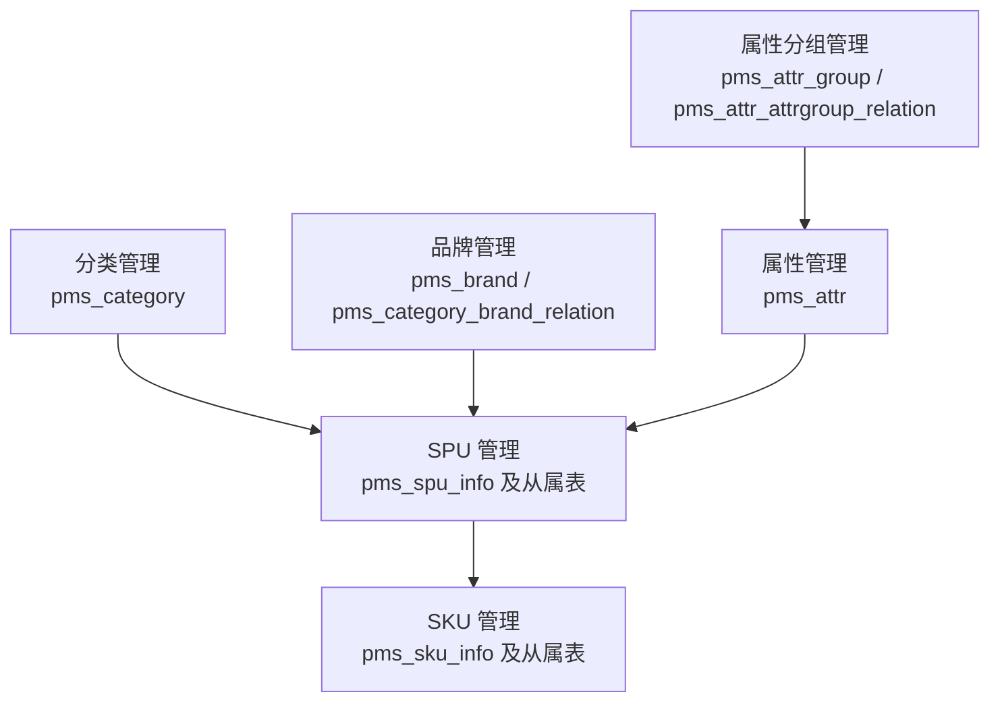
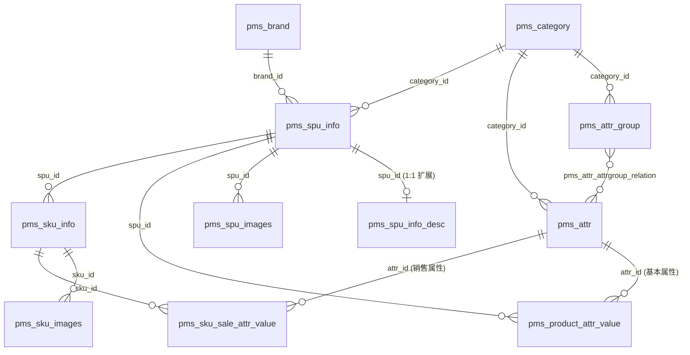
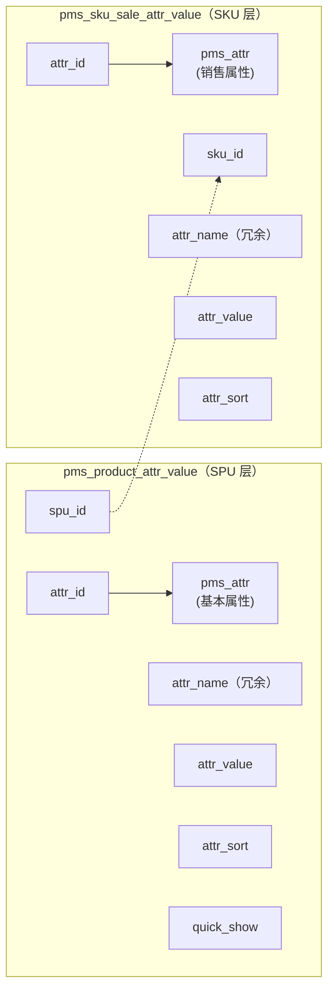

# 商品中心（mall-product）- 模块概述

> 模块：`mall-product`
> 数据库：`mall_product`
> 版本：v1.0
> 更新时间：2026-06-27

---

## 一、模块职责

商品中心是整个商城的数据基石，负责管理与商品相关的所有核心数据，向上支撑前台商品展示与检索，向下为价格、营销、订单、库存等上下游系统提供商品能力。

**核心职责**：

- 创建和管理商品（SPU/SKU）
- 创建和管理商品分类、品牌、属性等基础数据
- 对前台商品展示及上下游系统提供统一的商品数据和查询能力

**上下游关系**：

| 方向 | 关联模块 | 交互 |
|------|---------|------|
| 上游 | `mall-admin`（后台管理） | 商品录入、上下架、分类/品牌/属性管理 |
| 下游 | `mall-search`（搜索服务） | 商品数据同步到 OpenSearch，支持检索与聚合筛选 |
| 下游 | `mall-cart`（购物车） | SKU 信息查询（价格、标题、图片） |
| 下游 | `mall-order`（订单中心） | SKU 信息查询，下单时校验商品状态 |
| 下游 | `mall-ware`（库存中心） | SKU 维度的库存扣减/回滚 |
| 下游 | `mall-coupon`（营销中心） | 按 SPU/分类关联优惠券 |
| 下游 | `mall-seckill`（秒杀服务） | 秒杀活动关联 SKU |

---

## 二、功能域划分

商品中心包含 6 个功能域，相互独立、单向依赖：



| 功能域 | 说明 | 文档 |
|--------|------|------|
| 分类管理 | 三级分类树、批量删除、拖拽排序 | [category-management.md](./category-management.md) |
| 品牌管理 | 品牌 CRUD、品牌-分类多对多关联 | [brand-management.md](./brand-management.md) |
| 属性分组管理 | 属性分组 CRUD、分组-属性关联管理（1:1 业务约束） | [attrgroup-management.md](./attrgroup-management.md) |
| 属性管理 | 规格参数/销售属性 CRUD、共用接口按 attrType 区分 | [attr-management.md](./attr-management.md) |
| SPU 管理 | SPU CRUD、上下架、多表事务写入 | [spu-management.md](./spu-management.md) |
| SKU 管理 | SKU CRUD、销售属性组合唯一性校验 | [sku-management.md](./sku-management.md) |

**依赖关系**：分类、品牌、属性是基础数据，SPU 依赖这三者，SKU 依赖 SPU。开发顺序遵循此依赖链。

---

## 三、核心概念

### 3.1 SPU（Standard Product Unit，标准产品单位）

商品信息聚合的**最小单位**，是一组具有共同属性的商品集合，描述"这一类商品"。

- 例：「iPhone 15」是一个 SPU；「小米电视 Redmi MAX 100英寸」是一个 SPU。
- SPU **不可直接售卖**，没有价格、没有库存——它只是"商品档案"。
- SPU 上挂载：
  - 基本信息：名称、描述、所属分类、品牌、重量、上下架状态
  - 商品介绍：富文本（拆到 `pms_spu_info_desc` 扩展表，避免大字段拖慢主表）
  - 商品图片集：`pms_spu_images`
  - 规格参数值：`pms_product_attr_value`（基本属性的取值）
- 一个 SPU 必须归属一个**三级分类**和一个**品牌**。

### 3.2 SKU（Stock Keeping Unit，库存量单位）

可售卖、可库存的**最小单位**，对应一种具体的规格组合。

- 例：「iPhone 15 / 256G / 钛蓝色」是一个 SKU；「iPhone 15 / 512G / 钛蓝色」是另一个 SKU。
- SKU **可直接售卖**，有独立的价格、库存、销量、图片。
- SKU 由 **SPU + 销售属性组合**派生：
  - 理论上 SKU 数量 = 各销售属性可选值的笛卡尔积
  - 实际业务可只取部分组合（不全量铺货），如颜色×版本有 3×4=12 种组合，只发布其中 8 种
- SKU 上挂载：
  - 价格、标题、副标题、默认图、销量
  - SKU 图片集：`pms_sku_images`
  - 销售属性值：`pms_sku_sale_attr_value`（记录该 SKU 在每个销售属性上的取值）
- 一个 SPU 下有 1~N 个 SKU；SKU 必须归属一个 SPU。

> **SPU 与 SKU 的关系类比**：SPU 是"产品型号"，SKU 是"具体到规格的存货单位"。库存、价格、交易都发生在 SKU 维度；商品档案、介绍、参数展示发生在 SPU 维度。

### 3.3 属性（`pms_attr`）—— 属性的元数据定义

属性表存的是属性的**定义（模板）**，不是某个商品的属性值。例如定义"颜色"这个属性、它的可选值是"红,蓝,黑"。

| 字段 | 含义 |
|------|------|
| `attr_name` | 属性名，如"颜色""屏幕尺寸" |
| `attr_type` | **属性类型**：`0`-销售属性、`1`-基本属性（规格参数）、`2`-既是销售又是基本 |
| `category_id` | 所属分类（属性按分类归属，不同分类可用不同属性） |
| `value_type` | 值类型：`0`-单值、`1`-多选值（如"支持频段"可多选） |
| `value_select` | 可选值列表，逗号分隔，如"红,蓝,黑" |
| `search_type` | 是否参与检索（`0`-否 `1`-是），决定是否同步到搜索引擎做筛选 |
| `show_desc` | 是否快速展示（`0`-否 `1`-是），详情页参数区置顶展示 |
| `enable` | 启用状态（`0`-禁用 `1`-启用） |

> **`attr_type` 是属性体系的核心开关**：它决定一个属性是落在 SPU 层（基本属性 → `pms_product_attr_value`）还是 SKU 层（销售属性 → `pms_sku_sale_attr_value`）。`attr_type=2` 的属性两处都会用到。
>
> **属性归属分类的意义**：录入商品时，根据 SPU 的三级分类带出该分类下所有可用属性（基本属性填到规格参数区，销售属性用于生成 SKU 规格矩阵），避免每个商品重复定义属性。

### 3.4 属性分组（`pms_attr_group`）

把同一分类下的**基本属性**组织成逻辑分组，便于商品详情页参数表分区展示。

- 例：手机分类下有分组「主体」「显示屏」「网络」「电池」，每组下挂若干基本属性。
- 属性分组**只针对基本属性**（规格参数），销售属性不分组（销售属性数量少，直接平铺为规格选择器）。
- 分组通过 `pms_attr_attrgroup_relation` 与属性关联：表结构支持**多对多**，但**业务层强制 1:1**——一个基本属性最多归属一个分组（避免详情页参数表重复展示、简化前端交互）。约束在 Service 层实现，表结构不变。
- 分组归属一个**三级分类**（`category_id`）。

### 3.5 规格参数（基本属性）值 vs 销售属性值

两者结构相似但归属不同，是初学者最易混淆处：

| 维度 | 规格参数值（基本属性） | 销售属性值 |
|------|----------------------|-----------|
| 表 | `pms_product_attr_value` | `pms_sku_sale_attr_value` |
| 归属 | **SPU**（`spu_id`） | **SKU**（`sku_id`） |
| 关联属性 | `attr_id` → `pms_attr`（`attr_type=1/2`） | `attr_id` → `pms_attr`（`attr_type=0/2`） |
| 用途 | 详情页参数表、检索筛选 | 详情页规格选择、区分 SKU |
| 是否分组 | 是，归入属性分组 | 否 |
| 示例 | "屏幕尺寸=6.1英寸" | "颜色=钛蓝色" |

> **为什么冗余 `attr_name`？** `pms_product_attr_value` 和 `pms_sku_sale_attr_value` 都冗余存了 `attr_name`。因为属性改名是低频操作，而属性值查询是高频操作——冗余后详情页/检索无需回联 `pms_attr` 表取名字。代价是属性改名时需同步刷新这两张表的 `attr_name`（见 [属性管理](./attr-management.md)）。

> **为什么属性要分两类？** 规格参数是"为了让用户了解商品"（详情页参数表、检索筛选），销售属性是"为了让用户选择商品"（详情页规格选择、决定买哪个 SKU）。两者用途不同，存储位置不同（SPU 层 vs SKU 层），但元数据定义统一在 `pms_attr` 表中，靠 `attr_type` 区分，避免重复定义。

---

## 四、实体关系

### 4.1 关系总览

| 关系 | 基数 | 外键字段 | 说明 |
|------|------|---------|------|
| 分类 → 属性分组 | 1 : N | `pms_attr_group.category_id` | 一个分类下有多个属性分组 |
| 分类 → 属性 | 1 : N | `pms_attr.category_id` | 一个分类下定义多个属性（基本+销售） |
| 属性分组 ↔ 属性 | N : N | `pms_attr_attrgroup_relation` | 表结构多对多；业务层强制 1:1（一个基本属性最多归属一个分组） |
| 分类 → SPU | 1 : N | `pms_spu_info.category_id` | SPU 归属一个三级分类 |
| 品牌 → SPU | 1 : N | `pms_spu_info.brand_id` | SPU 归属一个品牌 |
| SPU → 商品介绍 | 1 : 1 | `pms_spu_info_desc.spu_id`（UK） | 富文本拆扩展表 |
| SPU → SPU 图片 | 1 : N | `pms_spu_images.spu_id` | SPU 的图片集 |
| SPU → 规格参数值 | 1 : N | `pms_product_attr_value.spu_id` | SPU 的基本属性取值 |
| 规格参数值 → 属性 | N : 1 | `pms_product_attr_value.attr_id` | 指向基本属性定义 |
| SPU → SKU | 1 : N | `pms_sku_info.spu_id` | 一个 SPU 派生多个 SKU |
| SKU → SKU 图片 | 1 : N | `pms_sku_images.sku_id` | SKU 的图片集 |
| SKU → 销售属性值 | 1 : N | `pms_sku_sale_attr_value.sku_id` | 该 SKU 的销售属性取值 |
| 销售属性值 → 属性 | N : 1 | `pms_sku_sale_attr_value.attr_id` | 指向销售属性定义 |

### 4.2 ER 图



### 4.3 关系详解

**① 属性体系的"分类 → 分组 → 属性"三层**

```
三级分类（level=3）
  ├─ 属性分组 A「主体」
  │    ├─ 基本属性：品牌型号、上市年份
  │    └─ 基本属性：机身颜色（参数，非销售）
  ├─ 属性分组 B「显示屏」
  │    └─ 基本属性：屏幕尺寸、分辨率
  └─ 销售属性（不分组，平铺）
       ├─ 颜色（attr_type=0）
       └─ 版本（attr_type=0）
```

- 录入商品时：选完三级分类 → 自动带出该分类的属性分组及组内基本属性（填值进 `pms_product_attr_value`）+ 销售属性（用于生成 SKU 矩阵）。
- 属性与分组的关联带 `attr_sort`，控制详情页参数表内属性展示顺序。

**② SPU 的"1 主表 + 3 从属"结构**

```
pms_spu_info（主表：名称/分类/品牌/重量/上下架）
  ├─ pms_spu_info_desc   1:1  富文本介绍（拆表，避免 text 拖慢主表查询）
  ├─ pms_spu_images      1:N  图片集（带 img_sort、default_img）
  └─ pms_product_attr_value  1:N  规格参数值（每个基本属性一条记录）
```

> **为什么介绍拆 1:1 扩展表？** `pms_spu_info` 主表会被列表/检索高频扫描，而 `decript` 是大段富文本（text）。拆到 `pms_spu_info_desc` 后，列表查询只读主表轻量字段，详情页才 join 扩展表取介绍。这是"垂直拆分"的典型实践。

**③ SKU 的派生与挂载**

```
SPU「iPhone 15」
  ├─ SKU「256G/钛蓝色」  ← pms_sku_info
  │    ├─ 销售属性值：版本=256G、颜色=钛蓝色  ← pms_sku_sale_attr_value
  │    └─ SKU 图片集                           ← pms_sku_images
  ├─ SKU「512G/钛蓝色」
  │    ├─ 销售属性值：版本=512G、颜色=钛蓝色
  │    └─ SKU 图片集
  └─ SKU「1T/粉色」
       └─ ...
```

- SKU 的"身份"由其销售属性值组合唯一确定：同一 SPU 下，**销售属性值组合相同的 SKU 不应存在**（业务层去重，见 [SKU 管理](./sku-management.md)）。
- SKU 的 `category_id` / `brand_id` 冗余自 SPU，便于按分类/品牌直接查 SKU（避免回联 SPU 表）。

**④ 两张属性值表的对称结构**



两者都引用 `pms_attr`，区别仅在 `attr_type` 与归属层级。这种对称设计使检索同步（Canal → ES）和详情页渲染逻辑可复用。

---

## 五、数据模型概览

> 完整建表见 `init/mysql/mymall_pms.sql`。以下仅列各表归属与设计要点，详细字段见各功能域文档。

### 5.1 基础数据三表

| 表 | 归属功能域 | 关键字段 | 设计要点 |
|----|-----------|---------|---------|
| `pms_category` | 分类管理 | `parent_id`、`level`、`sort`、`show_status` | 三级分类树，逻辑删除用 `show_status` |
| `pms_brand` | 品牌管理 | `name`、`logo`、`first_letter`、`show_status` | 品牌名全局唯一 |
| `pms_category_brand_relation` | 品牌管理 | `brand_id`、`category_id`、冗余 `brand_name`/`category_name` | 品牌-分类多对多关联 |

### 5.2 属性元数据三表

| 表 | 归属功能域 | 关键字段 | 设计要点 |
|----|-----------|---------|---------|
| `pms_attr` | 属性管理 | `attr_type`、`category_id`、`value_select`、`search_type`、`show_desc` | 属性定义按分类归属；`attr_type` 区分基本/销售 |
| `pms_attr_group` | 属性分组管理 | `attr_group_name`、`category_id`、`sort` | 分组按分类归属，仅组织基本属性 |
| `pms_attr_attrgroup_relation` | 属性分组管理 | `attr_id`、`attr_group_id`、`attr_sort` | 多对多关联；`uk_attr_group(attr_id, attr_group_id)` 防重复；业务层强制 1:1 |

### 5.3 SPU 四表

| 表 | 归属功能域 | 关键字段 | 设计要点 |
|----|-----------|---------|---------|
| `pms_spu_info` | SPU 管理 | `category_id`、`brand_id`、`publish_status`、`weight` | 主表，索引 `idx_category_id` / `idx_brand_id` |
| `pms_spu_info_desc` | SPU 管理 | `spu_id`（UK）、`decript` | 1:1 扩展表，富文本拆表 |
| `pms_spu_images` | SPU 管理 | `spu_id`、`img_url`、`img_sort`、`default_img` | 图片集，按 `spu_id` 索引 |
| `pms_product_attr_value` | SPU 管理 | `spu_id`、`attr_id`、`attr_name`、`attr_value`、`quick_show` | 规格参数值，冗余 `attr_name` |

### 5.4 SKU 三表

| 表 | 归属功能域 | 关键字段 | 设计要点 |
|----|-----------|---------|---------|
| `pms_sku_info` | SKU 管理 | `spu_id`、`category_id`、`brand_id`、`price`、`sale_count` | 冗余分类/品牌便于直查；索引 `idx_spu_id` / `idx_category_id` / `idx_brand_id` |
| `pms_sku_images` | SKU 管理 | `sku_id`、`img_url`、`default_img` | SKU 图片集 |
| `pms_sku_sale_attr_value` | SKU 管理 | `sku_id`、`attr_id`、`attr_name`、`attr_value` | 销售属性值，冗余 `attr_name`；索引 `idx_sku_id` / `idx_attr_id` |

### 5.5 索引补充建议

- `pms_attr`：建议加 `idx_category_attr_type(category_id, attr_type)`，支撑"按分类查基本属性/销售属性"高频查询
- `pms_sku_sale_attr_value`：建议加 `uk_sku_attr(sku_id, attr_id)`，保证一个 SKU 在同一销售属性上只取一个值
- 逻辑删除与唯一约束冲突的处理思路同 [品牌管理](./brand-management.md)

---

## 六、非功能性要求

| 项目 | 要求 |
|------|------|
| 性能 | 列表查询 < 200ms（命中分类/品牌索引）；详情页 SPU 聚合查询 < 300ms |
| 并发 | 属性/SPU/SKU 写为低频后台操作，乐观锁（`@Version`）即可 |
| 缓存 | 属性定义、属性分组按分类缓存到 Redis（TTL 30 分钟），写操作后主动失效 |
| 事务 | SPU 新增/修改/删除跨 4 表、SKU 跨 3 表，必须 `@Transactional` |
| 检索同步 | `search_type=1` 的属性值、`publish_status=1` 的 SPU/SKU 通过 Canal → MQ → OpenSearch 同步 |
| 一致性 | 属性改名 → 同步刷新 `pms_product_attr_value` / `pms_sku_sale_attr_value` 的 `attr_name` |
| 安全 | 管理接口需管理员权限（网关 JWT 鉴权，待实现） |
| 日志 | 写操作记录操作人 + 变更内容；查询不记录 |
| 幂等 | 新增靠业务唯一性兜底（属性名、SKU 组合）；其余覆盖写天然幂等 |

---

## 七、错误码规划

商品中心错误码按功能域分段，统一在 `mall-common` 的 `ResultCode` 枚举中定义：

| 码段 | 功能域 | 文档 |
|------|--------|------|
| 52001~52999 | 商品分类 | [category-management.md](./category-management.md) |
| 53001~53999 | 商品品牌 | [brand-management.md](./brand-management.md) |
| 54001~54005 | 属性管理（规格参数/销售属性） | [attr-management.md](./attr-management.md) |
| 54010~54015 | 属性分组管理（分组 + 分组-属性关联） | [attrgroup-management.md](./attrgroup-management.md) |
| 54020~54024 | SPU 管理 | [spu-management.md](./spu-management.md) |
| 54030~54033 | SKU 管理 | [sku-management.md](./sku-management.md) |

> 各功能域的错误码定义见对应文档的"错误码"章节。
