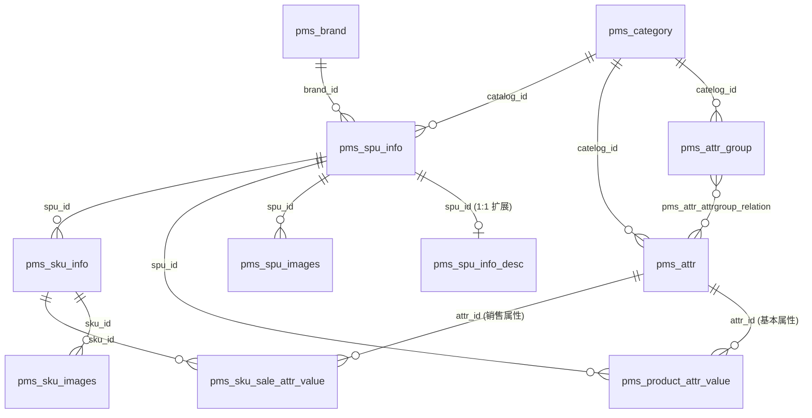

# SPU / SKU / 规格参数 / 销售属性 - 需求与设计文档

> 模块：`mall-product`
> 表：`pms_attr`、`pms_attr_group`、`pms_attr_attrgroup_relation`、`pms_spu_info`、`pms_spu_info_desc`、`pms_spu_images`、`pms_product_attr_value`、`pms_sku_info`、`pms_sku_images`、`pms_sku_sale_attr_value`
> 版本：v1.0
> 更新时间：2026-06-24

---

## 一、业务背景

商品中心是整个商城的数据基石，而 SPU/SKU 与属性体系又是商品中心最核心、最容易混淆的部分。本文档先讲清概念与实体关系，再落到表设计与接口。

一个完整商品从"录入"到"售卖"涉及三层抽象：

```
分类（决定可用属性/属性分组）→ SPU（一类商品）→ SKU（一个可售卖规格）
```

- **分类**为商品提供属性模板（哪些规格参数、哪些销售属性可用），见 [分类管理](./category-management.md)。
- **SPU** 描述"这一类商品"的共同特征，挂规格参数、介绍、图片。
- **SKU** 描述"一个具体可售卖规格"，挂价格、库存、销售属性值、图片。

属性体系分两类：
- **规格参数（基本属性）**：描述商品固有特征，挂在 SPU 上，不参与区分 SKU（如屏幕尺寸、CPU）。
- **销售属性**：参与区分 SKU，不同取值组合产生不同 SKU（如颜色、版本）。

> **为什么属性要分两类？** 规格参数是"为了让用户了解商品"（详情页参数表、检索筛选），销售属性是"为了让用户选择商品"（详情页规格选择、决定买哪个 SKU）。两者用途不同，存储位置不同（SPU 层 vs SKU 层），但元数据定义统一在 `pms_attr` 表中，靠 `attr_type` 区分，避免重复定义。

---

## 二、核心概念

### 2.1 SPU（Standard Product Unit，标准产品单位）

商品信息聚合的**最小单位**，是一组具有共同属性的商品集合，描述"这一类商品"。

- 例：「iPhone 15」是一个 SPU；「小米电视 Redmi MAX 100英寸」是一个 SPU。
- SPU **不可直接售卖**，没有价格、没有库存——它只是"商品档案"。
- SPU 上挂载：
  - 基本信息：名称、描述、所属分类、品牌、重量、上下架状态
  - 商品介绍：富文本（拆到 `pms_spu_info_desc` 扩展表，避免大字段拖慢主表）
  - 商品图片集：`pms_spu_images`
  - 规格参数值：`pms_product_attr_value`（基本属性的取值）
- 一个 SPU 必须归属一个**三级分类**和一个**品牌**。

### 2.2 SKU（Stock Keeping Unit，库存量单位）

可售卖、可库存的**最小单位**，对应一种具体的规格组合。

- 例：「iPhone 15 / 256G / 钛蓝色」是一个 SKU；「iPhone 15 / 512G / 钛蓝色」是另一个 SKU。
- SKU **可直接售卖**，有独立的价格、库存、销量、图片。
- SKU 由 **SPU + 销售属性组合**派生：
  - 理论上 SKU 数量 = 各销售属性可选值的笛卡尔积
  - 实际业务可只取部分组合（不全量铺货），如颜色×版本有 3×4=12 种组合，只发布其中 8 种
- SKU 上挂载：
  - 价格、标题、副标题、默认图、销量
  - SKU 图片集：`pms_sku_images`
  - 销售属性值：`pms_sku_sale_attr_value`（记录该 SKU 在每个销售属性上的取值）
- 一个 SPU 下有 1~N 个 SKU；SKU 必须归属一个 SPU。

> **SPU 与 SKU 的关系类比**：SPU 是"产品型号"，SKU 是"具体到规格的存货单位"。库存、价格、交易都发生在 SKU 维度；商品档案、介绍、参数展示发生在 SPU 维度。

### 2.3 属性（`pms_attr`）—— 属性的元数据定义

属性表存的是属性的**定义（模板）**，不是某个商品的属性值。例如定义"颜色"这个属性、它的可选值是"红,蓝,黑"。

| 字段 | 含义 |
|------|------|
| `attr_name` | 属性名，如"颜色""屏幕尺寸" |
| `attr_type` | **属性类型**：`0`-销售属性、`1`-基本属性（规格参数）、`2`-既是销售又是基本 |
| `catelog_id` | 所属分类（属性按分类归属，不同分类可用不同属性） |
| `value_type` | 值类型：`0`-单值、`1`-多选值（如"支持频段"可多选） |
| `value_select` | 可选值列表，逗号分隔，如"红,蓝,黑" |
| `search_type` | 是否参与检索（`0`-否 `1`-是），决定是否同步到搜索引擎做筛选 |
| `show_desc` | 是否快速展示（`0`-否 `1`-是），详情页参数区置顶展示 |
| `enable` | 启用状态（`0`-禁用 `1`-启用） |

> **`attr_type` 是属性体系的核心开关**：它决定一个属性是落在 SPU 层（基本属性 → `pms_product_attr_value`）还是 SKU 层（销售属性 → `pms_sku_sale_attr_value`）。`attr_type=2` 的属性两处都会用到。
>
> **属性归属分类的意义**：录入商品时，根据 SPU 的三级分类带出该分类下所有可用属性（基本属性填到规格参数区，销售属性用于生成 SKU 规格矩阵），避免每个商品重复定义属性。

### 2.4 属性分组（`pms_attr_group`）

把同一分类下的**基本属性**组织成逻辑分组，便于商品详情页参数表分区展示。

- 例：手机分类下有分组「主体」「显示屏」「网络」「电池」，每组下挂若干基本属性。
- 属性分组**只针对基本属性**（规格参数），销售属性不分组（销售属性数量少，直接平铺为规格选择器）。
- 分组通过 `pms_attr_attrgroup_relation` 与属性是**多对多**关系：一个分组下有多个属性，一个属性理论上也可归入多个分组（虽然实际多为一对一，但表结构支持多对多）。
- 分组归属一个**三级分类**（`catelog_id`）。

### 2.5 规格参数（基本属性）值 vs 销售属性值

两者结构相似但归属不同，是初学者最易混淆处：

| 维度 | 规格参数值（基本属性） | 销售属性值 |
|------|----------------------|-----------|
| 表 | `pms_product_attr_value` | `pms_sku_sale_attr_value` |
| 归属 | **SPU**（`spu_id`） | **SKU**（`sku_id`） |
| 关联属性 | `attr_id` → `pms_attr`（`attr_type=1/2`） | `attr_id` → `pms_attr`（`attr_type=0/2`） |
| 用途 | 详情页参数表、检索筛选 | 详情页规格选择、区分 SKU |
| 是否分组 | 是，归入属性分组 | 否 |
| 示例 | "屏幕尺寸=6.1英寸" | "颜色=钛蓝色" |

> **为什么冗余 `attr_name`？** `pms_product_attr_value` 和 `pms_sku_sale_attr_value` 都冗余存了 `attr_name`。因为属性改名是低频操作，而属性值查询是高频操作——冗余后详情页/检索无需回联 `pms_attr` 表取名字。代价是属性改名时需同步刷新这两张表的 `attr_name`（见 [一致性](#九非功能性要求)）。

---

## 三、实体关系

### 3.1 关系总览

| 关系 | 基数 | 外键字段 | 说明 |
|------|------|---------|------|
| 分类 → 属性分组 | 1 : N | `pms_attr_group.catelog_id` | 一个分类下有多个属性分组 |
| 分类 → 属性 | 1 : N | `pms_attr.catelog_id` | 一个分类下定义多个属性（基本+销售） |
| 属性分组 ↔ 属性 | N : N | `pms_attr_attrgroup_relation` | 分组下挂多个基本属性 |
| 分类 → SPU | 1 : N | `pms_spu_info.catalog_id` | SPU 归属一个三级分类 |
| 品牌 → SPU | 1 : N | `pms_spu_info.brand_id` | SPU 归属一个品牌 |
| SPU → 商品介绍 | 1 : 1 | `pms_spu_info_desc.spu_id`（UK） | 富文本拆扩展表 |
| SPU → SPU 图片 | 1 : N | `pms_spu_images.spu_id` | SPU 的图片集 |
| SPU → 规格参数值 | 1 : N | `pms_product_attr_value.spu_id` | SPU 的基本属性取值 |
| 规格参数值 → 属性 | N : 1 | `pms_product_attr_value.attr_id` | 指向基本属性定义 |
| SPU → SKU | 1 : N | `pms_sku_info.spu_id` | 一个 SPU 派生多个 SKU |
| SKU → SKU 图片 | 1 : N | `pms_sku_images.sku_id` | SKU 的图片集 |
| SKU → 销售属性值 | 1 : N | `pms_sku_sale_attr_value.sku_id` | 该 SKU 的销售属性取值 |
| 销售属性值 → 属性 | N : 1 | `pms_sku_sale_attr_value.attr_id` | 指向销售属性定义 |

### 3.2 ER 图



### 3.3 关系详解

**① 属性体系的"分类 → 分组 → 属性"三层**

```
三级分类（cat_level=3）
  ├─ 属性分组 A「主体」
  │    ├─ 基本属性：品牌型号、上市年份
  │    └─ 基本属性：机身颜色（参数，非销售）
  ├─ 属性分组 B「显示屏」
  │    └─ 基本属性：屏幕尺寸、分辨率
  └─ 销售属性（不分组，平铺）
       ├─ 颜色（attr_type=0）
       └─ 版本（attr_type=0）
```

- 录入商品时：选完三级分类 → 自动带出该分类的属性分组及组内基本属性（填值进 `pms_product_attr_value`）+ 销售属性（用于生成 SKU 矩阵）。
- 属性与分组的关联带 `attr_sort`，控制详情页参数表内属性展示顺序。

**② SPU 的"1 主表 + 3 从属"结构**

```
pms_spu_info（主表：名称/分类/品牌/重量/上下架）
  ├─ pms_spu_info_desc   1:1  富文本介绍（拆表，避免 text 拖慢主表查询）
  ├─ pms_spu_images      1:N  图片集（带 img_sort、default_img）
  └─ pms_product_attr_value  1:N  规格参数值（每个基本属性一条记录）
```

> **为什么介绍拆 1:1 扩展表？** `pms_spu_info` 主表会被列表/检索高频扫描，而 `decript` 是大段富文本（text）。拆到 `pms_spu_info_desc` 后，列表查询只读主表轻量字段，详情页才 join 扩展表取介绍。这是"垂直拆分"的典型实践。

**③ SKU 的派生与挂载**

```
SPU「iPhone 15」
  ├─ SKU「256G/钛蓝色」  ← pms_sku_info
  │    ├─ 销售属性值：版本=256G、颜色=钛蓝色  ← pms_sku_sale_attr_value
  │    └─ SKU 图片集                           ← pms_sku_images
  ├─ SKU「512G/钛蓝色」
  │    ├─ 销售属性值：版本=512G、颜色=钛蓝色
  │    └─ SKU 图片集
  └─ SKU「1T/粉色」
       └─ ...
```

- SKU 的"身份"由其销售属性值组合唯一确定：同一 SPU 下，**销售属性值组合相同的 SKU 不应存在**（业务层去重，见 [SKU 新增](#46-新增-sku)）。
- SKU 的 `catalog_id` / `brand_id` 冗余自 SPU，便于按分类/品牌直接查 SKU（避免回联 SPU 表）。

**④ 两张属性值表的对称结构**

```
pms_product_attr_value（SPU 层）        pms_sku_sale_attr_value（SKU 层）
  spu_id  ──────────────────────────       sku_id
  attr_id ─► pms_attr (基本属性)           attr_id ─► pms_attr (销售属性)
  attr_name（冗余）                         attr_name（冗余）
  attr_value                                attr_value
  attr_sort                                 attr_sort
  quick_show                                —
```

两者都引用 `pms_attr`，区别仅在 `attr_type` 与归属层级。这种对称设计使检索同步（Canal → ES）和详情页渲染逻辑可复用。

---

## 四、功能需求

### 4.1 功能清单

| 编号 | 功能 | 说明 |
|------|------|------|
| A1 | 属性分组分页查询 | 按三级分类查询属性分组，支持分组名模糊、分页 |
| A2 | 属性分组详情/新增/修改/删除 | 标准 CRUD，删除前校验组下是否有属性 |
| A3 | 分组-属性关联管理 | 查询分组下属性、为分组添加/移除属性 |
| B1 | 规格参数（基本属性）分页查询 | 按分类查询基本属性，支持 `attr_type` 过滤 |
| B2 | 规格参数详情/新增/修改/删除 | 标准 CRUD，删除前校验是否被 SPU 引用 |
| B3 | 销售属性分页查询 | 按分类查询销售属性 |
| B4 | 销售属性详情/新增/修改/删除 | 与规格参数共用 `pms_attr`，`attr_type=0` |
| C1 | SPU 分页查询 | 按分类、品牌、上架状态、关键字筛选 |
| C2 | SPU 详情 | 含介绍、图片集、规格参数值 |
| C3 | 新增 SPU | 主表 + 介绍 + 图片集 + 规格参数值，事务写入 |
| C4 | 修改 SPU | 全量覆盖图片集与规格参数值 |
| C5 | SPU 上架/下架 | 切换 `publish_status` |
| C6 | 删除 SPU | 校验是否存在 SKU，逻辑删除级联从属表 |
| D1 | SKU 分页查询 | 按 SPU 查询其下 SKU |
| D2 | SKU 详情 | 含图片集、销售属性值 |
| D3 | 新增 SKU | 校验销售属性值组合唯一，事务写入 |
| D4 | 修改 SKU | 同步更新销售属性值与图片集 |
| D5 | 删除 SKU | 逻辑删除级联从属表 |

> 属性分组、规格参数、销售属性的管理界面在后台通常按"选中三级分类 → 展示对应分组/属性"组织，见 [接口设计](#五接口设计)。

### 4.2 业务规则

#### 属性分组（A1~A3）

- 分组名在同一分类下唯一（业务层校验，建议加 `uk_catelog_name(catelog_id, attr_group_name, is_deleted)`）
- `catelog_id` 必须为存在的三级分类（`cat_level = 3`）
- 删除分组前：若 `pms_attr_attrgroup_relation` 仍有该分组的关联记录，先解除关联或拒绝删除
- 分组下属性查询：联表 `pms_attr_attrgroup_relation` + `pms_attr`，按 `attr_sort` 升序

#### 规格参数 / 销售属性（B1~B4、B3~B4）

- 属性名在同一分类下唯一（业务层校验）
- `attr_type` 决定属性归属层：`1`-仅基本、`0`-仅销售、`2`-两者皆是
- `value_select` 逗号分隔的可选值；前端录入商品时下拉选择，也可自定义输入
- `search_type=1` 的属性，其值变更需同步到搜索引擎（Canal binlog → MQ → OpenSearch）
- 删除属性前：校验 `pms_product_attr_value` / `pms_sku_sale_attr_value` 是否有引用，有则拒绝
- 属性改名时：同步刷新 `pms_product_attr_value.attr_name` 与 `pms_sku_sale_attr_value.attr_name`

#### SPU（C1~C6）

- `catalog_id` 必须为三级分类，`brand_id` 必须存在且属于该分类（查 `pms_category_brand_relation`）
- 新增 SPU：主表 + 介绍（`pms_spu_info_desc`）+ 图片集 + 规格参数值，**同一事务**写入
- 规格参数值：仅 `attr_type ∈ {1,2}` 的属性可填；`attr_id` 必须属于 SPU 的分类
- SPU 默认 `publish_status=0`（下架），需手动上架后才可被检索/购买
- 修改 SPU：图片集与规格参数值采用**全量覆盖**（逻辑删旧 + 插新），主表字段 `updateById`（携带 `version` 乐观锁）
- 删除 SPU：`pms_sku_info` 存在 SKU 则拒绝；否则逻辑删除主表 + 介绍 + 图片集 + 规格参数值（级联，同事务）

#### SKU（D1~D5）

- `spu_id` 必须存在；`catalog_id` / `brand_id` 冗余自 SPU，由后端填充，前端不传
- 新增 SKU：销售属性值组合（`attr_id` → `attr_value` 集合）在同一 SPU 下**必须唯一**，否则抛 `SKU_ATTR_COMBO_DUPLICATE`
- 销售属性值：仅 `attr_type ∈ {0,2}` 的属性可用；`attr_id` 必须属于 SPU 分类下的销售属性
- `price` 必须 > 0；`sku_default_img` 必填（若无单独默认图，取 `pms_sku_images` 中 `default_img=1` 的图）
- 修改 SKU：销售属性值与图片集全量覆盖
- 删除 SKU：逻辑删除 `pms_sku_info` + `pms_sku_images` + `pms_sku_sale_attr_value`（级联，同事务）；删除前评估库存/订单引用（跨服务，由 ware/order 判断）

---

## 五、接口设计

### 5.1 接口总览

| 接口 | 方法 | 路径 | 说明 |
|------|------|------|------|
| 分组分页查询 | GET | `/product/attrgroup/list` | 按三级分类 + 分组名模糊分页 |
| 分组详情 | GET | `/product/attrgroup/{id}` | 含组下属性列表 |
| 新增分组 | POST | `/product/attrgroup` | |
| 修改分组 | PUT | `/product/attrgroup` | |
| 删除分组 | DELETE | `/product/attrgroup/{id}` | 校验组下属性 |
| 分组下属性 | GET | `/product/attrgroup/{id}/attrs` | 联表查询 |
| 添加分组属性 | POST | `/product/attrgroup/relation` | 批量关联 |
| 移除分组属性 | DELETE | `/product/attrgroup/relation` | 批量解联 |
| 规格参数分页 | GET | `/product/attr/base/list` | `attr_type=1/2`，按分类 |
| 销售属性分页 | GET | `/product/attr/sale/list` | `attr_type=0/2`，按分类 |
| 属性详情 | GET | `/product/attr/{id}` | |
| 新增属性 | POST | `/product/attr` | |
| 修改属性 | PUT | `/product/attr` | 改名同步刷新冗余 |
| 删除属性 | DELETE | `/product/attr/{id}` | 校验引用 |
| SPU 分页查询 | GET | `/product/spu/list` | 按分类/品牌/状态/关键字 |
| SPU 详情 | GET | `/product/spu/{id}` | 含介绍/图片/规格参数值 |
| 新增 SPU | POST | `/product/spu` | 事务写多表 |
| 修改 SPU | PUT | `/product/spu` | 全量覆盖从属 |
| SPU 上架/下架 | PUT | `/product/spu/{id}/publish` | 切换状态 |
| 删除 SPU | DELETE | `/product/spu/{id}` | 校验 SKU |
| SKU 分页查询 | GET | `/product/sku/list` | 按 SPU |
| SKU 详情 | GET | `/product/sku/{id}` | 含图片/销售属性值 |
| 新增 SKU | POST | `/product/sku` | 校验组合唯一 |
| 修改 SKU | PUT | `/product/sku` | 全量覆盖从属 |
| 删除 SKU | DELETE | `/product/sku/{id}` | 级联逻辑删除 |

> 所有接口经网关，前端 `baseUrl=/api`，网关将 `/api/product/**` 路由到 `mall-product`（`StripPrefix=1`），与品牌/分类接口共用 `product-route`。

### 5.2 新增 SPU（最复杂接口，示例）

**POST** `/product/spu`

**请求体**（`SpuSaveDTO`）：

```json
{
    "spuName": "iPhone 15",
    "spuDescription": "Apple iPhone 15",
    "catalogId": 225,
    "brandId": 1,
    "weight": 171.0,
    "publishStatus": 0,
    "decript": "<富文本介绍>",
    "images": [
        { "imgUrl": "https://oss.example.com/spu/1.jpg", "imgSort": 0, "defaultImg": 1 },
        { "imgUrl": "https://oss.example.com/spu/2.jpg", "imgSort": 1, "defaultImg": 0 }
    ],
    "baseAttrs": [
        { "attrId": 1001, "attrName": "屏幕尺寸", "attrValue": "6.1英寸", "quickShow": 1 },
        { "attrId": 1002, "attrName": "CPU", "attrValue": "A16", "quickShow": 0 }
    ]
}
```

| 字段 | 类型 | 必填 | 校验规则 |
|------|------|------|---------|
| `spuName` | String | 是 | `@NotBlank`，最大 200 |
| `catalogId` | Long | 是 | 存在的三级分类 |
| `brandId` | Long | 是 | 存在且属于该分类 |
| `weight` | BigDecimal | 否 | `@DecimalMin("0")` |
| `publishStatus` | Integer | 否 | 0/1，默认 0 |
| `decript` | String | 否 | 富文本介绍 |
| `images` | `List<SpuImageDTO>` | 否 | SPU 图片集 |
| `baseAttrs` | `List<SpuAttrValueDTO>` | 否 | 规格参数值，`attrId` 须为分类下基本属性 |

**业务逻辑**：

```
1. 校验 catalogId 为三级分类
2. 校验 brandId 属于该分类（pms_category_brand_relation）
3. 校验 baseAttrs 中每个 attrId 属于该分类且 attr_type ∈ {1,2}
4. 插入 pms_spu_info（审计字段自动填充）
5. 插入 pms_spu_info_desc（spu_id 关联）
6. 批量插入 pms_spu_images
7. 批量插入 pms_product_attr_value（冗余 attr_name）
   （4~7 同一事务 @Transactional）
```

**响应**：

```json
{ "code": 200, "msg": "success", "data": { "id": 1001 } }

// 品牌与分类不匹配
{ "code": 54012, "msg": "品牌 [1] 不属于分类 [225]", "data": null }
```

### 5.3 新增 SKU

**POST** `/product/sku`

**请求体**（`SkuSaveDTO`）：

```json
{
    "spuId": 1001,
    "skuName": "iPhone 15 256G 钛蓝色",
    "price": 5999.00,
    "skuTitle": "Apple iPhone 15 256G 钛蓝色",
    "skuSubtitle": "限时优惠",
    "skuDefaultImg": "https://oss.example.com/sku/1.jpg",
    "images": [
        { "imgUrl": "https://oss.example.com/sku/1.jpg", "imgSort": 0, "defaultImg": 1 }
    ],
    "saleAttrs": [
        { "attrId": 2001, "attrName": "颜色", "attrValue": "钛蓝色" },
        { "attrId": 2002, "attrName": "版本", "attrValue": "256G" }
    ]
}
```

**业务逻辑**：

```
1. 查 SPU，不存在抛 SPU_NOT_FOUND；取 catalog_id / brand_id 冗余写入 SKU
2. 校验 saleAttrs 中每个 attrId 属于该分类且 attr_type ∈ {0,2}
3. 组合唯一性校验：该 SPU 下已存在相同销售属性值组合的 SKU → 抛 SKU_ATTR_COMBO_DUPLICATE
4. 插入 pms_sku_info
5. 批量插入 pms_sku_images
6. 批量插入 pms_sku_sale_attr_value（冗余 attr_name）
   （4~6 同一事务 @Transactional）
```

> 其余接口（分组/属性 CRUD、SPU 修改/上下架/删除、SKU 修改/删除）体例与品牌接口一致，此处不逐一展开，实现时按 [品牌管理](./brand-management.md) 的模板补全。

---

## 六、DTO / VO 定义

```
com.mymall.product.dto.attr/
├── AttrGroupSaveDTO.java        // 属性分组新增/修改
├── AttrGroupQueryDTO.java       // 分组分页查询
├── AttrSaveDTO.java             // 属性新增/修改（含 attr_type）
├── AttrQueryDTO.java            // 属性分页查询
└── AttrRelationDTO.java         // 分组-属性关联（批量）

com.mymall.product.dto.spu/
├── SpuSaveDTO.java              // SPU 新增/修改
├── SpuQueryDTO.java             // SPU 分页查询
├── SpuImageDTO.java             // SPU 图片项
├── SpuAttrValueDTO.java         // 规格参数值项
├── SpuPublishDTO.java           // 上架/下架
├── SkuSaveDTO.java              // SKU 新增/修改
├── SkuImageDTO.java             // SKU 图片项
└── SkuSaleAttrValueDTO.java     // 销售属性值项

com.mymall.product.vo/
├── AttrGroupVO.java             // 分组详情（含 attrs）
├── AttrVO.java                  // 属性详情
├── SpuVO.java                   // SPU 详情（含介绍/图片/规格参数）
└── SkuVO.java                   // SKU 详情（含图片/销售属性）
```

### 6.1 SpuSaveDTO（示意）

```java
@Data
@Schema(description = "新增/修改 SPU")
public class SpuSaveDTO {

    @NotNull(groups = Update.class, message = "SPU ID 不能为空")
    private Long id;

    @NotBlank(message = "商品名称不能为空")
    @Size(max = 200)
    private String spuName;

    @Size(max = 1024)
    private String spuDescription;

    @NotNull(message = "所属分类不能为空")
    private Long catalogId;

    @NotNull(message = "品牌不能为空")
    private Long brandId;

    @DecimalMin(value = "0", message = "重量不能为负")
    private BigDecimal weight;

    @Schema(description = "上架状态：0-下架 1-上架")
    private Integer publishStatus;

    @Schema(description = "富文本介绍")
    private String decript;

    @Valid
    private List<SpuImageDTO> images;

    @Valid
    private List<SpuAttrValueDTO> baseAttrs;

    @NotNull(groups = Update.class, message = "版本号不能为空")
    private Integer version;
}
```

---

## 七、数据模型

> 完整建表见 `init/mysql/mymall_pms.sql`。以下仅列各表关键字段与设计要点。

### 7.1 属性元数据三表

| 表 | 关键字段 | 设计要点 |
|----|---------|---------|
| `pms_attr` | `attr_type`、`catelog_id`、`value_select`、`search_type`、`show_desc` | 属性定义按分类归属；`attr_type` 区分基本/销售 |
| `pms_attr_group` | `attr_group_name`、`catelog_id`、`sort` | 分组按分类归属，仅组织基本属性 |
| `pms_attr_attrgroup_relation` | `attr_id`、`attr_group_id`、`attr_sort` | 多对多关联；`uk_attr_group(attr_id, attr_group_id)` 防重复 |

### 7.2 SPU 四表

| 表 | 关键字段 | 设计要点 |
|----|---------|---------|
| `pms_spu_info` | `catalog_id`、`brand_id`、`publish_status`、`weight` | 主表，索引 `idx_catalog_id` / `idx_brand_id` |
| `pms_spu_info_desc` | `spu_id`（UK）、`decript` | 1:1 扩展表，富文本拆表 |
| `pms_spu_images` | `spu_id`、`img_url`、`img_sort`、`default_img` | 图片集，按 `spu_id` 索引 |
| `pms_product_attr_value` | `spu_id`、`attr_id`、`attr_name`、`attr_value`、`quick_show` | 规格参数值，冗余 `attr_name` |

### 7.3 SKU 三表

| 表 | 关键字段 | 设计要点 |
|----|---------|---------|
| `pms_sku_info` | `spu_id`、`catalog_id`、`brand_id`、`price`、`sale_count` | 冗余分类/品牌便于直查；索引 `idx_spu_id` / `idx_catalog_id` / `idx_brand_id` |
| `pms_sku_images` | `sku_id`、`img_url`、`default_img` | SKU 图片集 |
| `pms_sku_sale_attr_value` | `sku_id`、`attr_id`、`attr_name`、`attr_value` | 销售属性值，冗余 `attr_name`；索引 `idx_sku_id` / `idx_attr_id` |

### 7.4 索引补充建议

- `pms_attr`：建议加 `idx_catelog_attr_type(catelog_id, attr_type)`，支撑"按分类查基本属性/销售属性"高频查询
- `pms_sku_sale_attr_value`：建议加 `uk_sku_attr(sku_id, attr_id)`，保证一个 SKU 在同一销售属性上只取一个值
- 逻辑删除与唯一约束冲突的处理思路同 [品牌管理 - 索引](./brand-management.md#33-索引)

---

## 八、错误码

在 `ResultCode` 中补充 SPU/SKU/属性相关错误码（**54001+ 码段**，紧接品牌 53001~53005 之后）：

| 错误码 | 枚举值 | 消息 | 触发场景 |
|--------|--------|------|---------|
| 54001 | `ATTR_NOT_FOUND` | 属性不存在 | ID 查询不到 |
| 54002 | `ATTR_NAME_DUPLICATE` | 同分类下属性名已存在 | 新增/改名 |
| 54003 | `ATTR_HAS_REFERENCE` | 属性已被商品引用，无法删除 | 删除时属性值表有引用 |
| 54004 | `ATTR_TYPE_INVALID` | 属性类型非法 | `attr_type` 非 0/1/2 |
| 54010 | `ATTR_GROUP_NOT_FOUND` | 属性分组不存在 | ID 查询不到 |
| 54011 | `ATTR_GROUP_NAME_DUPLICATE` | 同分类下分组名已存在 | 新增/改名 |
| 54012 | `ATTR_GROUP_HAS_ATTRS` | 分组下存在属性，无法删除 | 删除分组时有关联属性 |
| 54020 | `SPU_NOT_FOUND` | 商品不存在 | ID 查询不到 |
| 54021 | `SPU_CATEGORY_INVALID` | 分类不存在或非三级分类 | `catalogId` 校验失败 |
| 54022 | `SPU_BRAND_INVALID` | 品牌不属于该分类 | `brandId` 与分类不匹配 |
| 54023 | `SPU_HAS_SKUS` | 商品下存在 SKU，无法删除 | 删除 SPU 时有 SKU |
| 54024 | `SPU_ATTR_INVALID` | 规格参数不属于该分类或类型不匹配 | `baseAttrs` 校验失败 |
| 54030 | `SKU_NOT_FOUND` | SKU 不存在 | ID 查询不到 |
| 54031 | `SKU_ATTR_COMBO_DUPLICATE` | 同一商品下销售属性组合已存在 | SKU 组合唯一性冲突 |
| 54032 | `SKU_SALE_ATTR_INVALID` | 销售属性不属于该分类或类型不匹配 | `saleAttrs` 校验失败 |
| 54033 | `SKU_PRICE_INVALID` | SKU 价格非法 | `price` ≤ 0 |

对应枚举（追加到 `ResultCode`）：

```java
// ==================== 商品属性 54001+ ====================
ATTR_NOT_FOUND(54001, "属性不存在"),
ATTR_NAME_DUPLICATE(54002, "同分类下属性名已存在"),
ATTR_HAS_REFERENCE(54003, "属性已被商品引用，无法删除"),
ATTR_TYPE_INVALID(54004, "属性类型非法"),
// ==================== 属性分组 54010+ ====================
ATTR_GROUP_NOT_FOUND(54010, "属性分组不存在"),
ATTR_GROUP_NAME_DUPLICATE(54011, "同分类下分组名已存在"),
ATTR_GROUP_HAS_ATTRS(54012, "分组下存在属性，无法删除"),
// ==================== 商品 SPU 54020+ ====================
SPU_NOT_FOUND(54020, "商品不存在"),
SPU_CATEGORY_INVALID(54021, "分类不存在或非三级分类"),
SPU_BRAND_INVALID(54022, "品牌不属于该分类"),
SPU_HAS_SKUS(54023, "商品下存在 SKU，无法删除"),
SPU_ATTR_INVALID(54024, "规格参数不属于该分类或类型不匹配"),
// ==================== 商品 SKU 54030+ ====================
SKU_NOT_FOUND(54030, "SKU 不存在"),
SKU_ATTR_COMBO_DUPLICATE(54031, "同一商品下销售属性组合已存在"),
SKU_SALE_ATTR_INVALID(54032, "销售属性不属于该分类或类型不匹配"),
SKU_PRICE_INVALID(54033, "SKU 价格非法"),
```

> 同时在 `ResultCode` 头部码段规划注释中补：`53001~53999 - 商品品牌`、`54001~54999 - 商品属性/SPU/SKU`。

---

## 九、非功能性要求

| 项目 | 要求 |
|------|------|
| 性能 | 列表查询 < 200ms（命中分类/品牌索引）；详情页 SPU 聚合查询 < 300ms |
| 并发 | 属性/SPU/SKU 写为低频后台操作，乐观锁（`@Version`）即可 |
| 缓存 | 属性定义、属性分组按分类缓存到 Redis（TTL 30 分钟），写操作后主动失效 |
| 事务 | SPU 新增/修改/删除跨 4 表、SKU 跨 3 表，必须 `@Transactional` |
| 检索同步 | `search_type=1` 的属性值、`publish_status=1` 的 SPU/SKU 通过 Canal → MQ → OpenSearch 同步 |
| 一致性 | 属性改名 → 同步刷新 `pms_product_attr_value` / `pms_sku_sale_attr_value` 的 `attr_name` |
| 安全 | 管理接口需管理员权限（网关 JWT 鉴权，待实现） |
| 日志 | 写操作记录操作人 + 变更内容；查询不记录 |
| 幂等 | 新增靠业务唯一性兜底（属性名、SKU 组合）；其余覆盖写天然幂等 |

---

## 十、实现清单

| 序号 | 任务 | 文件 |
|------|------|------|
| 1 | 补充 ResultCode 属性/SPU/SKU 错误码 + 码段注释 | `mall-common/.../exception/ResultCode.java` |
| 2 | 创建属性分组 DTO/VO + 实体（已存在）+ Service + Controller | `mall-product/.../attrgroup/` |
| 3 | 创建属性（规格参数/销售属性）DTO/VO + Service + Controller | `mall-product/.../attr/` |
| 4 | 创建 SPU DTO/VO + Service + Controller（含事务多表写入） | `mall-product/.../spu/` |
| 5 | 创建 SKU DTO/VO + Service + Controller（含组合唯一性校验） | `mall-product/.../sku/` |
| 6 | 属性改名同步刷新冗余字段（监听属性 update） | `AttrServiceImpl` |
| 7 | 补充索引 SQL（`idx_catelog_attr_type`、`uk_sku_attr`） | `init/mysql/mymall_pms.sql` |
| 8 | 创建 HTTP 调试文件 | `http/product-spu-sku-demo.http` |
