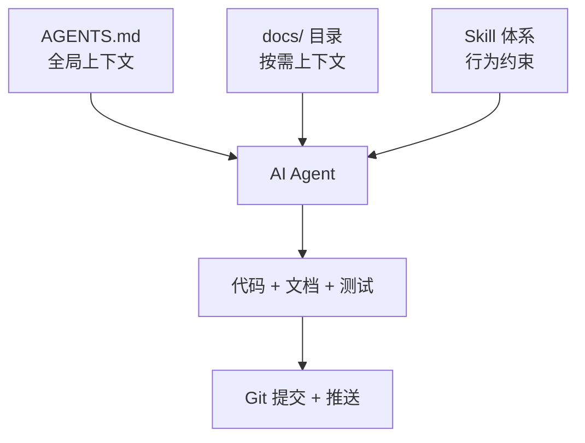

# AI 辅助开发体系

> 本项目全程在 AI 辅助下开发（Trae IDE），本文档讲清楚三件事：
> 1. **上下文管理** — AI 怎么知道项目的规范和约束？（AGENTS.md + docs/）
> 2. **Skill 体系** — AI 怎么保证代码质量而不是"随便写"？（Skill 列表 + 触发机制）
> 3. **AGENTS.md 解读** — 全局上下文文件各 section 的设计意图

---

## 一、概述

本项目使用 Trae IDE 进行 AI 辅助开发。AI 不是简单的"代码补全工具"，而是通过以下机制参与完整开发流程：

- **AGENTS.md** — AI 每次对话都会自动读取，相当于"始终在线"的项目说明书
- **docs/** — AI 通过 AGENTS.md 中的索引按需查阅详细规范，不一次性加载全部文档
- **Skill** — 特定场景下自动触发的行为约束，强制 AI 遵循规范流程（如 TDD、代码审查）

---

## 二、上下文管理

### 2.1 为什么需要上下文管理

AI 的上下文窗口有限（通常 128K~200K tokens）。如果把所有文档、代码、规范都塞进去，会导致：
- **上下文膨胀**：重要信息被淹没，AI 注意力分散
- **成本上升**：每次对话都传输大量无关内容
- **指令冲突**：多个文档对同一问题给出不一致的指引

因此需要**分层管理上下文**，确保 AI 在正确的时间看到正确的信息。

### 2.2 上下文分层

| 层级 | 载体 | 加载时机 | 内容 | 大小控制 |
|------|------|---------|------|---------|
| **L1 始终在线** | `AGENTS.md` | 每次对话自动读取 | 技术选型、架构概览、代码组织、文档索引、提交规则 | < 200 行 |
| **L2 按需加载** | `docs/standards/*` | AI 按索引查阅 | 编码规范、Controller 规范、测试规范等 | 单篇 < 300 行 |
| **L3 模块专属** | `docs/{服务名}/*` | 开发该模块时查阅 | 模块概述、功能域设计、接口文档 | 按功能域拆分 |
| **L4 学习参考** | `docs/learn-docs/*` | 学习或查原理时查阅 | 技术原理、业界方案对比 | 按主题组织 |

### 2.3 AGENTS.md 的精简策略

AGENTS.md 是 L1 上下文，**必须精简**。判断标准：

| 放 AGENTS.md | 提取到 docs/ |
|-------------|-------------|
| 每次开发都要看的技术选型、架构 | 只在写文档时看的文档规范 |
| 每次提交都要看的规则 | 只在写测试时看的测试规范 |
| 高频查阅的文档索引表 | 只在某个模块开发时看的设计文档 |
| 代码组织结构（包结构约定） | 某个组件的详细设计 |

**已执行的提取**：
- 文档写作规范 → `docs/doc-convention.md`
- common 模块文档规范 → `docs/common/doc-convention.md`
- learn-docs 组织原则 → `docs/learn-docs/README.md`
- 微服务配置 → `docs/microservice/`
- 编码规范 → `docs/standards/`

AGENTS.md 只保留**索引指针**，指向详细文档。

---

## 三、Skill 体系

### 3.1 Skill 是什么

Skill 是 Trae IDE 的插件化能力，在特定场景下**自动约束 AI 的行为模式**。没有 Skill 时，AI 倾向于"一步到位"直接写实现代码；有了 Skill，AI 会先遵循规范流程（如先写测试、先理解需求、先验证再声称完成）。

### 3.2 Skill 列表速查

| Skill | 触发时机 | 作用 | 本项目使用 |
|-------|---------|------|-----------|
| `brainstorming` | 开始任何创造性工作前 | 强制 AI 先理解意图、探索方案，而非直接动手写代码 | ✅ |
| `test-driven-development` | 实现核心逻辑/bugfix 前 | 强制 AI 走 RED→GREEN→REFACTOR 循环，不写测试不写生产代码 | ✅ |
| `systematic-debugging` | 遇到 bug/测试失败时 | 强制 AI 走四阶段根因调查，而非"改改试试" | ✅ |
| `verification-before-completion` | 声称工作完成前 | 强制 AI 运行验证命令并展示输出，不凭感觉声称完成 | ✅ |
| `requesting-code-review` | 完成任务/重大功能后 | 派发 AI 代码审查，检查规范合规性和代码质量 | ✅ |
| `receiving-code-review` | 收到审查反馈时 | 强制 AI 先理解→验证→评估反馈，不盲从也不盲拒 | ✅ |
| `finishing-a-development-branch` | 实现完成、测试通过后 | 引导合并/提交/清理流程 | ✅ |
| `using-git-worktrees` | 需要隔离开发环境时 | 创建 git worktree 隔离功能开发 | ❌ 学习项目不需要 |
| `subagent-driven-development` | 多任务并行执行时 | 多 subagent 并行执行计划 | ❌ 单会话直接实现 |
| `executing-plans` | 有完整计划文档时 | 按计划文档逐步执行 | ❌ 轻量规范替代 |
| `writing-plans` | 多步骤任务前 | 写详尽的实现计划文档 | ❌ 简短规范替代 |
| `dispatching-parallel-agents` | 2+ 独立任务时 | 并行派发 agent | ❌ 暂无需求 |
| `using-superpowers` | 会话开始时 | 发现和加载可用的 Skill | ✅ 自动触发 |

### 3.3 核心开发 Skill 详解

#### brainstorming — 需求探索

**没有这个 Skill 时**：用户说"实现一个秒杀功能"，AI 直接开始写 Controller、Service、Mapper...

**有了这个 Skill 后**：AI 会先问：
- 秒杀的商品怎么配置？是普通商品还是专门的活动商品？
- 库存预减用什么方案？Redis 原子操作还是 Lua 脚本？
- 超时未支付怎么处理？RocketMQ 延迟消息还是定时任务？
- 并发防超卖的边界场景有哪些？

**价值**：避免 AI 在理解不足的情况下写出"能跑但有设计缺陷"的代码。

#### test-driven-development — TDD 循环

**没有这个 Skill 时**：AI 一次性写出完整的 Service 实现，然后补几个测试。

**有了这个 Skill 后**：AI 严格遵循：
1. **RED**：先写一个失败的测试，运行确认它失败（且因正确原因失败）
2. **GREEN**：写最小的实现代码让测试通过，不多写
3. **REFACTOR**：在测试保持绿色的前提下重构

**铁律**：没有失败的测试，就不写生产代码。

**适用场景**：核心逻辑（业务规则、状态流转、金额计算等）。样板代码（单表 CRUD）不强制走 TDD。

#### verification-before-completion — 验证完成

**没有这个 Skill 时**：AI 说"我已经完成了，代码应该可以正常工作"。

**有了这个 Skill 后**：AI 必须运行验证命令并展示输出：
- 运行单元测试，展示测试结果
- 运行编译，展示编译输出
- 检查无遗留 TODO/FIXME

**铁律**：没有新鲜的验证证据，就不能声称完成。

#### systematic-debugging — 系统化调试

**没有这个 Skill 时**：AI 看到 NullPointerException，直接加一个 `if (x != null)` 修复。

**有了这个 Skill 后**：AI 走四阶段：
1. **假设**：列出所有可能的原因
2. **插桩**：在关键位置添加日志或断言
3. **复现**：运行确认问题确实复现
4. **分析**：根据证据定位根因，修复根因而非症状

#### requesting-code-review / receiving-code-review — 代码审查

**审查维度**：
- 规范合规性：是否符合编码规范、Controller 规范、测试规范
- 代码质量：异常处理、日志、命名、事务边界

**处理反馈的原则**（receiving-code-review）：
- 先理解反馈的技术理由，不盲从
- 验证反馈是否正确，不盲目实现
- 评估反馈的适用场景，有些反馈可能不适合当前上下文

### 3.4 本项目不使用的 Skill 及原因

| Skill | 不使用原因 |
|-------|-----------|
| `using-git-worktrees` | 学习项目无需 worktree 隔离，直接在功能分支开发 |
| `subagent-driven-development` | 多 subagent 执行过重，单会话直接实现即可 |
| `executing-plans` / `writing-plans` | 轻量方案用简短规范（30 行内）替代详尽计划文档 |
| `dispatching-parallel-agents` | 当前阶段任务量不大，无需并行 |

> **原则**：Skill 是工具不是枷锁。选择适合项目规模和复杂度的 Skill，不为"仪式感"而使用。

---

## 四、AGENTS.md 内容解读

AGENTS.md 是项目的"全局上下文文件"，AI 每次对话都会读取。它的设计直接影响 AI 的行为质量。

### 4.1 各 Section 职责

| Section | 职责 | 为什么放这里 |
|---------|------|-------------|
| **核心原则** | 生产级标准的要求 | 每次开发都要遵守，必须始终在线 |
| **技术选型** | 依赖版本、框架选型 | AI 写代码时需要知道用什么版本，避免用错 API |
| **架构** | 整体架构、服务治理机制 | AI 需要理解全局架构才能正确设计模块 |
| **服务划分** | 13 个服务的职责和数据库 | AI 需要知道功能归属哪个服务 |
| **代码组织结构** | 包结构约定 + @MapperScan 规则 | AI 生成代码时必须遵循这个结构 |
| **项目文档** | 文档索引表 + 提交规则 | AI 通过索引按需查阅文档；提交规则每次提交都要看 |
| **根目录配置文件** | docker-compose 等配置文件索引 | AI 需要知道环境配置在哪 |

### 4.2 精简策略的实践

AGENTS.md 经历过多轮精简，核心原则是：**只放高频参考信息，详细规范提取到 docs/**。

**已提取的内容**：
- 文档写作规范（Mermaid vs 纯文本、模块文档组织）→ `docs/doc-convention.md`
- common 模块文档规范 → `docs/common/doc-convention.md`
- learn-docs 组织原则 → `docs/learn-docs/README.md`

**保留在 AGENTS.md 的内容**：
- 技术选型表（每次开发都要看版本）
- 架构概览（每次设计都要参考）
- 代码组织结构（每次生成代码都要遵循）
- 文档索引表（按需查阅的入口）
- 提交规则（每次提交都要看）

> **判断公式**：如果一条信息在大多数开发任务中都需要被 AI 看到，放 AGENTS.md；如果只在特定场景需要，提取到 docs/ 并在 AGENTS.md 留索引。

---

## 五、与 development-workflow.md 的关系

| 文档 | 视角 | 读者问题 |
|------|------|---------|
| **本文档**（ai-assisted-development.md） | 体系概览 | "AI 辅助开发的整体体系是怎样的？" |
| `development-workflow.md` | 流程规范 | "具体开发一个功能，分几步走？" |

本文档讲"为什么这样设计"（上下文管理、Skill 体系、AGENTS.md 结构），`development-workflow.md` 讲"具体怎么做"（三阶段流程、TDD 循环、核心/样板判定）。

两者互补：先读本文档理解体系，再读 `development-workflow.md` 执行具体流程。
